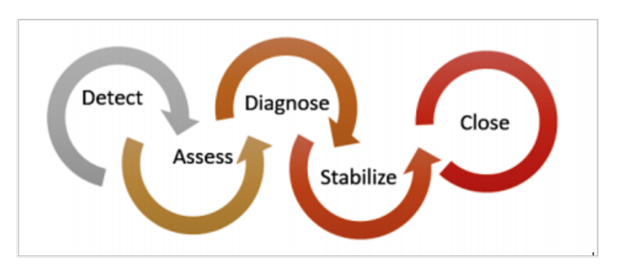
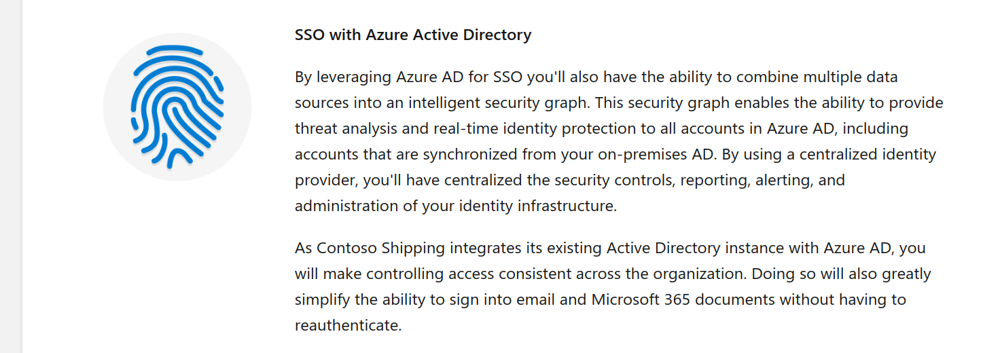
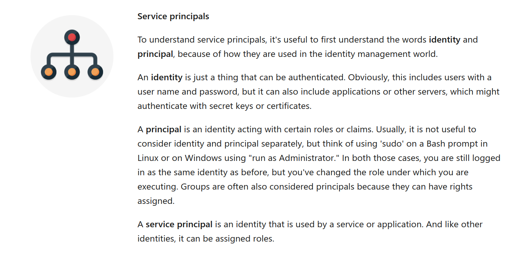
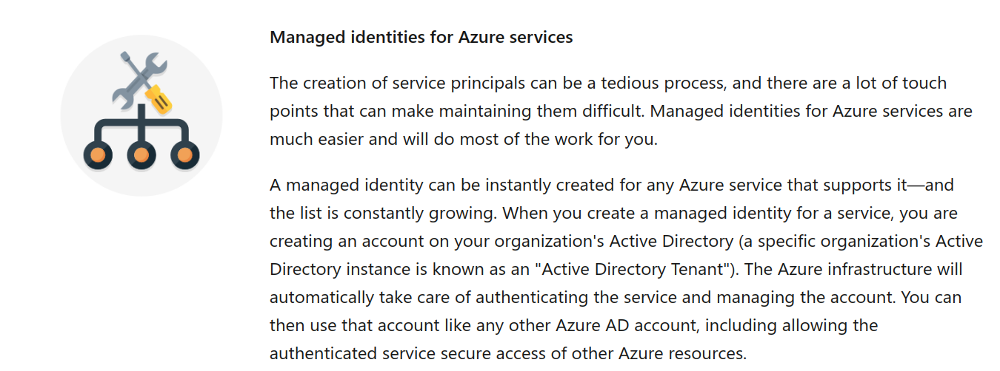
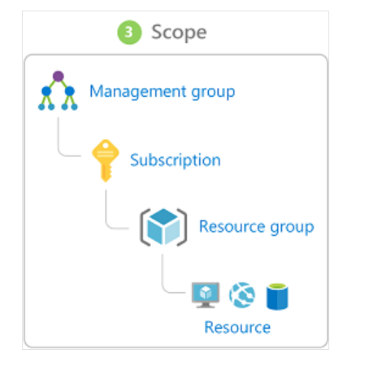
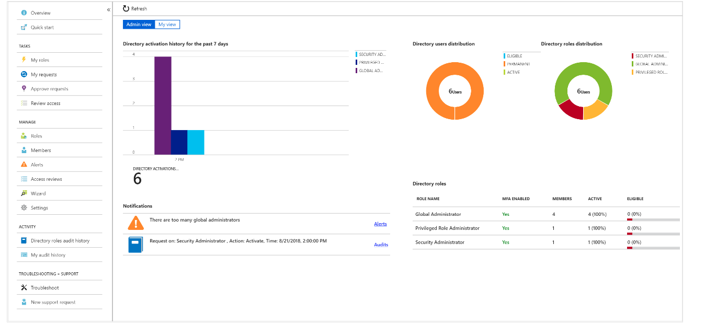
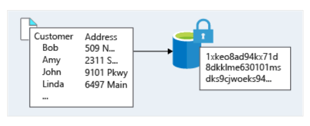
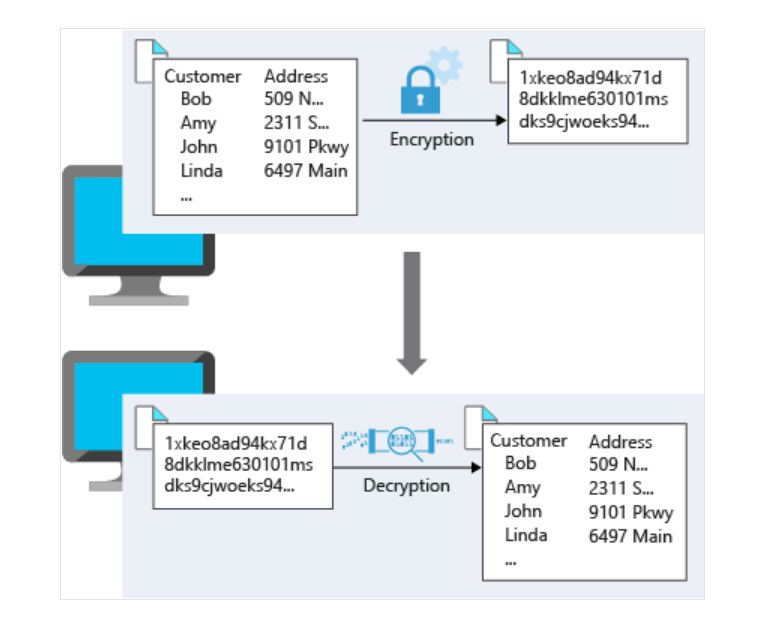
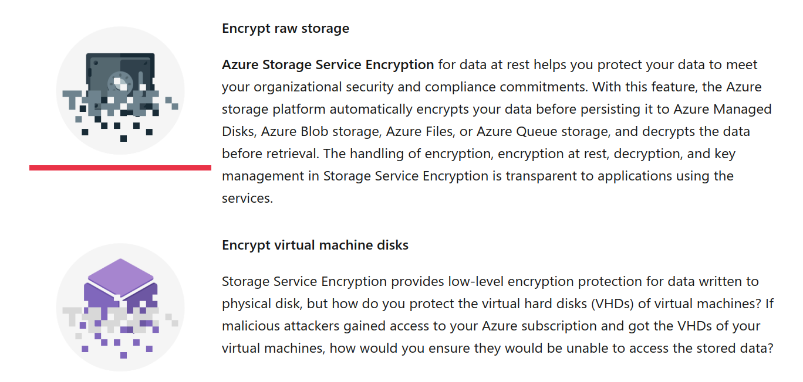
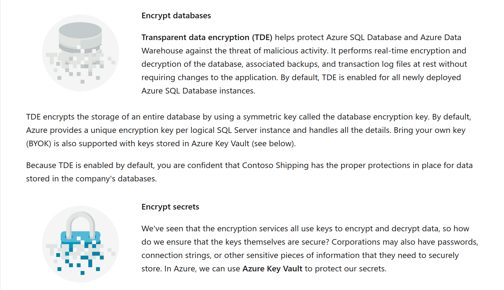

## 1 security, responsibility, and trust in Azure

[Introduction](https://docs.microsoft.com/en-us/learn/modules/intro-to-security-in-azure/1-introduction)

Every system, architecture, and application needs to be designed with security in mind. There's too much at risk. For instance, a denial of service attack could prevent your customer from reaching your web site or services and block you from doing business. Defacement of your website damages your reputation. And a data breach could be even worse — as it can ruin hard-earned trust, while causing significant personal and financial harm. As administrators, developers, and IT management, we all must work to guarantee the security of our systems.
Let's say you work at a company called Contoso Shipping, and you're spearheading the development of drone deliveries in rural areas-while having truck drivers leverage mobile apps to deliver to urban areas. You're in the process of moving much of Contoso Shipping's infrastructure to the cloud to maximize efficiency, as well as moving several physical servers in the company's data center to Azure virtual machines. Your team plans on creating a hybrid solution, with some of the servers remaining on-premises, so you'll need a secure, high-quality connection between the new virtual machines and the existing network.

Additionally, Contoso Shipping has some out-of-network devices that are part of your operations. You are using network-enabled sensors in your drones that send data to Azure Event Hubs, while delivery drivers use mobile apps to get route maps and record signatures for receipt of shipments. These devices and apps must be securely authenticated before data can be sent to or from them.

Additionally, Contoso Shipping has some out-of-network devices that are part of your operations. You are using network-enabled sensors in your drones that send data to Azure Event Hubs, while delivery drivers use mobile apps to get route maps and record signatures for receipt of shipments. These devices and apps must be securely authenticated before data can be sent to or from them.

So how do you keep your data secure?

Azure Event Hubs allow you to receive and process millions of events of real-time data each second via dynamic data pipelines. Event Hubs also integrates seamlessly with other Azure services.

Learning objectives

|In this module, you will learn how:|
|-----------------------------------------------|
|Security responsibility is shared with Azure|
|Identity management provides protection, even outside your network|
|Encryption capabilities built into Azure can protect your data|
|To protect your network and virtual networks|

Prerequisites
None

Next unit: Cloud security is a shared responsibility

## Cloud security is a shared responsibility
11 minutes
Organizations face many challenges with securing their datacenters, including recruiting and keeping security experts, using many security tools, and keeping pace with the volume and complexity of threats. As computing environments move from customer-controlled datacenters to the cloud, the responsibility of security also shifts. Security of the operational environment is now a concern shared by both cloud providers and customers. By shifting these responsibilities to a cloud service like Azure, organizations can reduce focus on activities that aren't core business competencies. Depending on the specific technology choices, some security protections will be built into the particular service, while addressing others will remain the customer's responsibility. To ensure that the proper security controls are provided, a careful evaluation of the services and technology choices becomes necessary.

## Security is a shared responsibility

The first shift you'll make is from on-premises data centers to infrastructure as a service (IaaS). With IaaS, you are leveraging the lowest-level service and asking Azure to create virtual machines (VMs) and virtual networks. At this level, it's still your responsibility to patch and secure your operating systems and software, as well as configure your network to be secure. At Contoso Shipping, you are taking advantage of IaaS when you start using Azure VMs instead of your on-premises physical servers. In addition to the operational advantages, you receive the security advantage of having outsourced concern over protecting the physical parts of the network.

Moving to platform as a service (PaaS) outsources several security concerns. At this level, Azure is taking care of the operating system and of most foundational software like database management systems. Everything is updated with the latest security patches and can be integrated with Azure Active Directory for access controls. PaaS also comes with many operational advantages. Rather than building whole infrastructures and subnets for your environments by hand, you can "point and click" within the Azure portal or run automated scripts to bring complex, secured systems up and down, and scale them as needed. Contoso Shipping uses Azure Event Hubs for ingesting telemetry data from drones and trucks — as well as a web app with an Azure Cosmos DB back end with its mobile apps — which are all examples of PaaS.

With software as a service (SaaS), you outsource almost everything. SaaS is software that runs with an internet infrastructure. The code is controlled by the vendor but configured to be used by the customer. Like so many companies, Contoso Shipping uses Microsoft 365 (formerly Office 365), which is a great example of SaaS!

For all cloud deployment types, you own your data and identities. You are responsible for helping secure your data and identities, your on-premises resources, and the cloud components you control (which vary by service type).

Regardless of the deployment type, you always retain responsibility for the following items:

|data is a liability always|
|----------------------------|
|Data|
|Endpoints|
|Accounts|
|Access management|

Azure security: you versus the cloud

## A layered approach to security
Defense in depth is a strategy that employs a series of mechanisms to slow the advance of an attack aimed at acquiring unauthorized access to information. Each layer provides protection so that if one layer is breached, a subsequent layer is already in place to prevent further exposure. Microsoft applies a layered approach to security, both in physical data centers and across Azure services. The objective of defense in depth is to protect and prevent information from being stolen by individuals who are not authorized to access it.

Defense in depth can be visualized as a set of concentric rings, with the data to be secured at the center. Each ring adds an additional layer of security around the data. This approach removes reliance on any single layer of protection and acts to slow down an attack and provide alert telemetry that can be acted upon, either automatically or manually. Let's take a look at each of the layers.

## A layered approach to security

Azure helps alleviate your security concerns. But security is still a shared responsibility. How much of that responsibility falls on us depends on which model we use with Azure. We use the defense in depth rings as a guideline for considering what protections are adequate for our data and environments.

Next unit: Get tips from Azure Security Center

Get tips from Azure Security Center
10 minutes
A great place to start when examining the security of your Azure-based solutions is Azure Security Center. Security Center is a monitoring service that provides threat protection across all of your services both in Azure, and on-premises. 

|Security Center can:|
||----------------------------------------------------------|
|Provide security recommendations based on your configurations, resources, and networks.|
|Monitor security settings across on-premises and cloud workloads, and automatically apply required security to new services as they come online.|
|Continuously monitor all your services, and perform automatic security assessments to identify potential vulnerabilities before they can be exploited.|
|Use machine learning to detect and block malware from being installed on your virtual machines and services. You can also define a list of allowed applications ||to ensure that only the apps you validate are allowed to execute.|
|Analyze and identify potential inbound attacks, and help to investigate threats and any post-breach activity that might have occurred.|
|Provide just-in-time access control for ports, reducing your attack surface by ensuring the network only allows traffic that you require.|

## Available tiers

|Azure Security Center is available in two tiers:|
|Free. Available as part of your Azure subscription, this tier is limited to assessments and recommendations of Azure resources only.|
|Standard. This tier provides a full suite of security-related services including continuous monitoring, threat detection, just-in-time access control for ports, and more.}

To access the full suite of Azure Security Center services, you will need to upgrade to a Standard tier subscription. You can access the 30-day free trial from within the Azure Security Center dashboard in the Azure portal. After the 30-day trial period is over, Azure Security Center is $15 per node per month.

## Usage scenarios
You can integrate Security Center into your workflows and use it in many ways. Here are two examples.

Use Security Center for incident response.
Many organizations learn how to respond to security incidents only after suffering an attack. To reduce costs and damage, it's important to have an incident response plan in place before an attack occurs. You can use Azure Security Center in different stages of an incident response.

You can use Security Center during the detect, assess, and diagnose stages. Here are examples of how Security Center can be useful during the three initial 

|stage|incident response stages:|
|Detect.| Review the first indication of an event investigation. For example, you can use the Security Center dashboard to review the initial verification that a high-priority security alert was raised.|
|Assess.| Perform the initial assessment to obtain more information about the suspicious activity. For example, obtain more information about the security alert.|
|Diagnose. |Conduct a technical investigation and identify containment, mitigation, and workaround strategies. For example, follow the remediation steps described by Security Center in that particular security alert.|

## Use Security Center recommendations to enhance security.

You can reduce the chances of a significant security event by configuring a security policy, and then implementing the recommendations provided by Azure Security Center. A security policy defines the set of controls that are recommended for resources within that specified subscription or resource group. In Security Center, you define policies according to your company's security requirements. Security Center analyzes the security state of your Azure resources. When Security Center identifies potential security vulnerabilities, it creates recommendations based on the controls set in the security policy. The recommendations guide you through the process of configuring the needed security controls. For example, if you have workloads that do not require the Azure SQL Database Transparent Data Encryption (TDE) policy, turn off the policy at the subscription level and enable it only in the resources groups where SQL TDE is required.
ImportantTo upgrade a subscription to the Standard tier, you must be assigned the role of Subscription Owner, Subscription Contributor, or Security Admin.

Next unit: Identity and access

Identity and access
10 minutes
Network perimeters, firewalls, and physical access controls used to be the primary protection for corporate data. But network perimeters have become increasingly porous with the explosion of bring your own device (BYOD), mobile apps, and cloud applications.

Identity has become the new primary security boundary. Therefore, proper authentication and assignment of privileges is critical to maintaining control of your data.

Your company, Contoso Shipping, is focused on addressing these concerns right away. Your team's new hybrid cloud solution needs to account for mobile apps that have access to secret data when an authorized user is signed in — in addition to having shipping vehicles constantly send a stream of telemetry data that is critical to optimizing the company's business.

Authentication and authorization
Two fundamental concepts that need to be understood when talking about identity and access control are authentication and authorization. They underpin everything else that happens and occur sequentially in any identity and access process:

Authentication is the process of establishing the identity of a person or service looking to access a resource. It involves the act of challenging a party for legitimate credentials, and provides the basis for creating a security principal for identity and access control use. It establishes if they are who they say they are.

Authorization is the process of establishing what level of access an authenticated person or service has. It specifies what data they're allowed to access and what they can do with it.

 Note

Authentication is sometimes shortened to AuthN, and authorization is sometimes shortened to AuthZ.

Azure provides services to manage both authentication and authorization through Azure Active Directory (Azure AD).

## What is Azure Active Directory?
Azure AD is a cloud-based identity service. It has built in support for synchronizing with your existing on-premises Active Directory or can be used stand-alone. This means that all your applications, whether on-premises, in the cloud (including Microsoft 365), or even mobile can share the same credentials. Administrators and developers can control access to internal and external data and applications using centralized rules and policies configured in Azure AD.

|what |Azure AD provides services such as|
|-------------|------------------------------------------------|
|Authentication.| This includes verifying identity to access applications and resources, and providing functionality such as self-service password reset, | \
|multi-factor authentication (MFA),| a custom banned password list, and smart lockout services.|
|Single-Sign-On (SSO).| SSO enables users to remember only one ID and one password to access multiple applications. A single identity is tied to a user, |
|simplifying the security model.| As users change roles or leave an organization, access modifications are tied to that identity, greatly reducing the effort needed to change or disable accounts.|
|Application management. |You can manage your cloud and on-premises apps using Azure AD Application Proxy, SSO, the My apps portal (also referred to as Access panel), and SaaS apps.|
|Business to business (B2B) identity services.| Manage your guest users and external partners while maintaining control over your own corporate data|
|Business-to-Customer (B2C) identity services. |Customize and control how users sign up, sign in, and manage their profiles when using your apps with services.
Device Management. Manage how your cloud or on-premises devices access your corporate data.|

Let's explore a few of these in more detail.

## Single sign-on
The more identities a user has to manage, the greater the risk of a credential-related security incident. More identities mean more passwords to remember and change. Password policies can vary between applications and, as complexity requirements increase, it becomes increasingly difficult for users to remember them.

Now, consider the logistics of managing all those identities. Additional strain is placed on help desks as they deal with account lockouts and password reset requests. If a user leaves an organization, tracking down all those identities and ensuring they are disabled can be challenging. If an identity is overlooked, this could allow access when it should have been eliminated.

With single sign-on (SSO), users need to remember only one ID and one password. Access across applications is granted to a single identity tied to a user, simplifying the security model. As users change roles or leave an organization, access modifications are tied to the single identity, greatly reducing the effort needed to change or disable accounts. Using single sign-on for accounts will make it easier for users to manage their identities and will increase the security capabilities in your environment.

## Multi-factor authentication
Multi-factor authentication (MFA) provides additional security for your identities by requiring two or more elements for full authentication. 

|These elements fall into three categories:|
|------------------------------------------|
|Something you know|
|Something you possess|
|Something you are|

Something you know would be a password or the answer to a security question. Something you possess could be a mobile app that receives a notification or a token-generating device. Something you are is typically some sort of biometric property, such as a fingerprint or face scan used on many mobile devices.

Using MFA increases security of your identity by limiting the impact of credential exposure. An attacker who has a user's password would also need to have possession of their phone or their security token generator in order to fully authenticate. Authentication with only a single factor verified is insufficient, and the attacker would be unable to use only those credentials to authenticate. The benefits this brings to security are huge, and we can't emphasize enough the importance of enabling MFA wherever possible.

Azure AD has MFA capabilities built in and will integrate with other third-party MFA providers. MFA should be used for users in the Global Administrator role in Azure AD, because these are highly sensitive accounts. All other accounts can also have MFA enabled.

For Contoso Shipping, you decide to enable MFA any time a user is signing in from a non-domain-connected computer — which includes the mobile apps your drivers use.

## Providing identities to services
It's usually valuable for services to have identities. Often, and against best practices, credential information is embedded in configuration files. With no security around these configuration files, anyone with access to the systems or repositories can access these credentials and risk exposure.

Azure AD addresses this problem through two methods: service principals and managed identities for Azure services.

## Role-based access control
Roles are sets of permissions, like "Read-only" or "Contributor", that users can be granted to access an Azure service instance.

Identities are mapped to roles directly or through group membership. Separating security principals, access permissions, and resources provides simple access management and fine-grained control. Administrators are able to ensure the minimum necessary permissions are granted.

Roles can be granted at the individual service instance level, but they also flow down the Azure Resource Manager hierarchy.

Here's a diagram that shows this relationship. Roles assigned at a higher scope, like an entire subscription, are inherited by child scopes, like service instances.

## Privileged Identity Management
In addition to managing Azure resource access with role-based access control (RBAC), a comprehensive approach to infrastructure protection should consider including the ongoing auditing of role members as their organization changes and evolves. Azure AD Privileged Identity Management (PIM) is an additional, paid-for offering that provides oversight of role assignments, self-service, and just-in-time role activation and Azure AD and Azure resource access reviews.

Summary
Identity allows us to maintain a security perimeter, even outside our physical control. With single sign-on and appropriate role-based access configuration, we can always be sure who has the ability to see and manipulate our data and infrastructure.

Next unit: Encryption

Encryption
8 minutes
For most organizations, data is the most valuable and irreplaceable asset. Encryption serves as the last and strongest line of defense in a layered security strategy.

Contoso Shipping knows that encryption is the only protection its data has once it leaves the data center and is stored on mobile devices that could potentially be hacked or stolen.

What is encryption?
Encryption is the process of making data unreadable and unusable to unauthorized viewers. To use or read the encrypted data, it must be decrypted, which requires the use of a secret key. There are two top-level types of encryption: symmetric and asymmetric.

Symmetric encryption uses the same key to encrypt and decrypt the data. Consider a desktop password manager application. You enter your passwords and they are encrypted with your own personal key (your key is often derived from your master password). When the data needs to be retrieved, the same key is used, and the data is decrypted.

Asymmetric encryption uses a public key and private key pair. Either key can encrypt but a single key can't decrypt its own encrypted data. To decrypt, you need the paired key. Asymmetric encryption is used for things like Transport Layer Security (TLS) (used in HTTPS) and data signing.

Both symmetric and asymmetric encryption play a role in properly securing your data. 

|Encryption is typically approached in two ways|
|----------------------------|
|Encryption at rest|
|Encryption in transit|

## Encryption at rest

Data at rest is the data that has been stored on a physical medium. This data could be stored on the disk of a server, data stored in a database, or data stored in a storage account. Regardless of the storage mechanism, encryption of data at rest ensures that the stored data is unreadable without the keys and secrets needed to decrypt it. If an attacker was to obtain a hard drive with encrypted data and did not have access to the encryption keys, the attacker would not compromise the data without great difficulty.

The actual data that is encrypted could vary in its content, usage, and importance to the organization. This financial information could be critical to the business, intellectual property that has been developed by the business, personal data about customers or employees that the business stores, and even the keys and secrets used for the encryption of the data itself.

Here's a diagram that shows what encrypted customer data might look like as it sits in a database.

## Encryption in transit

Data in transit is the data actively moving from one location to another, such as across the internet or through a private network. Secure transfer can be handled by several different layers. It could be done by encrypting the data at the application layer prior to sending it over a network. HTTPS is an example of application layer in transit encryption.
You can also set up a secure channel, like a virtual private network (VPN), at a network layer, to transmit data between two systems.
Encrypting data in transit protects the data from outside observers and provides a mechanism to transmit data while limiting risk of exposure.
This diagram shows the process. Here, customer data is encrypted as it's sent over the network. Only the receiver has the secret key that can decrypt the data to a usable form.

## Encryption on Azure
Let's take a look at some ways that Azure enables you to encrypt data across services.

Azure Disk Encryption is a capability that helps you encrypt your Windows and Linux IaaS virtual machine disks. Azure Disk Encryption leverages the industry-standard BitLocker feature of Windows and the dm-crypt feature of Linux to provide volume encryption for the OS and data disks. The solution is integrated with Azure Key Vault to help you control and manage the disk encryption keys and secrets (and you can use managed service identities for accessing Key Vault).
For Contoso Shipping, using VMs was one of the first moves toward the cloud. Having all the VHDs encrypted is an easy, low-impact way to ensure that you are doing all you can to secure your company's data.

Azure Key Vault is a centralized cloud service for storing your application secrets. Key Vault helps you control your applications' secrets by keeping them in a single, central location and by providing secure access, permissions control, and access logging capabilities. It is useful for a variety of scenarios:

Secrets management. You can use Key Vault to securely store and tightly control access to tokens, passwords, certificates, Application Programming Interface (API) keys, and other secrets.
Key management. You also can use Key Vault as a key management solution. Key Vault makes it easier to create and control the encryption keys used to encrypt your data.
Certificate management. Key Vault lets you provision, manage, and deploy your public and private Secure Sockets Layer/ Transport Layer Security (SSL/ TLS) certificates for your Azure, and internally connected, resources more easily.
Store secrets backed by hardware security modules (HSMs). The secrets and keys can be protected either by software, or by FIPS 140-2 Level 2 validated HSMs.
The benefits of using Key Vault include:

Centralized application secrets. Centralizing storage for application secrets allows you to control their distribution, and reduces the chances that secrets may be accidentally leaked.
Securely stored secrets and keys. Azure uses industry-standard algorithms, key lengths, and HSMs, and access requires proper authentication and authorization.
Monitor access and use. Using Key Vault, you can monitor and control access to company secrets.
Simplified administration of application secrets. Key Vault makes it easier to enroll and renew certificates from public Certificate Authorities (CAs). You can also scale up and replicate content within regions, and use standard certificate management tools.
Integrate with other Azure services. You can integrate Key Vault with storage accounts, container registries, event hubs, and many more Azure services.
Because Azure AD identities can be granted access to use Azure Key Vault secrets, applications with managed service identities enabled can automatically and seamlessly acquire the secrets they need.

## Summary
As you may know, encryption is often the last layer of defense from attackers and is an important piece of a layered approach to securing your systems. Azure provides built-in capabilities and services to encrypt and protect data from unintended exposure. Protection of customer data stored within Azure services is of paramount importance to Microsoft and should be included in any design. Foundational services such as Azure Storage, Azure Virtual Machines, Azure SQL Database, and Azure Key Vault can help secure your environment through encryption.

Next unit: Overview of Azure certificates
