## 1 security, responsibility, and trust in Azure

[Introduction](https://docs.microsoft.com/en-us/learn/modules/intro-to-security-in-azure/1-introduction)

Every system, architecture, and application needs to be designed with security in mind. There's too much at risk. For instance, a denial of service attack could prevent your customer from reaching your web site or services and block you from doing business. Defacement of your website damages your reputation. And a data breach could be even worse — as it can ruin hard-earned trust, while causing significant personal and financial harm. As administrators, developers, and IT management, we all must work to guarantee the security of our systems.
Let's say you work at a company called Contoso Shipping, and you're spearheading the development of drone deliveries in rural areas-while having truck drivers leverage mobile apps to deliver to urban areas. You're in the process of moving much of Contoso Shipping's infrastructure to the cloud to maximize efficiency, as well as moving several physical servers in the company's data center to Azure virtual machines. Your team plans on creating a hybrid solution, with some of the servers remaining on-premises, so you'll need a secure, high-quality connection between the new virtual machines and the existing network.

Additionally, Contoso Shipping has some out-of-network devices that are part of your operations. You are using network-enabled sensors in your drones that send data to Azure Event Hubs, while delivery drivers use mobile apps to get route maps and record signatures for receipt of shipments. These devices and apps must be securely authenticated before data can be sent to or from them.

Additionally, Contoso Shipping has some out-of-network devices that are part of your operations. You are using network-enabled sensors in your drones that send data to Azure Event Hubs, while delivery drivers use mobile apps to get route maps and record signatures for receipt of shipments. These devices and apps must be securely authenticated before data can be sent to or from them.

So how do you keep your data secure?

Azure Event Hubs allow you to receive and process millions of events of real-time data each second via dynamic data pipelines. Event Hubs also integrates seamlessly with other Azure services.

Learning objectives

|In this module, you will learn how:|
|-----------------------------------------------|
|Security responsibility is shared with Azure|
|Identity management provides protection, even outside your network|
|Encryption capabilities built into Azure can protect your data|
|To protect your network and virtual networks|

Prerequisites
None

Next unit: Cloud security is a shared responsibility

## Cloud security is a shared responsibility
11 minutes
Organizations face many challenges with securing their datacenters, including recruiting and keeping security experts, using many security tools, and keeping pace with the volume and complexity of threats. As computing environments move from customer-controlled datacenters to the cloud, the responsibility of security also shifts. Security of the operational environment is now a concern shared by both cloud providers and customers. By shifting these responsibilities to a cloud service like Azure, organizations can reduce focus on activities that aren't core business competencies. Depending on the specific technology choices, some security protections will be built into the particular service, while addressing others will remain the customer's responsibility. To ensure that the proper security controls are provided, a careful evaluation of the services and technology choices becomes necessary.

## Security is a shared responsibility

The first shift you'll make is from on-premises data centers to infrastructure as a service (IaaS). With IaaS, you are leveraging the lowest-level service and asking Azure to create virtual machines (VMs) and virtual networks. At this level, it's still your responsibility to patch and secure your operating systems and software, as well as configure your network to be secure. At Contoso Shipping, you are taking advantage of IaaS when you start using Azure VMs instead of your on-premises physical servers. In addition to the operational advantages, you receive the security advantage of having outsourced concern over protecting the physical parts of the network.

Moving to platform as a service (PaaS) outsources several security concerns. At this level, Azure is taking care of the operating system and of most foundational software like database management systems. Everything is updated with the latest security patches and can be integrated with Azure Active Directory for access controls. PaaS also comes with many operational advantages. Rather than building whole infrastructures and subnets for your environments by hand, you can "point and click" within the Azure portal or run automated scripts to bring complex, secured systems up and down, and scale them as needed. Contoso Shipping uses Azure Event Hubs for ingesting telemetry data from drones and trucks — as well as a web app with an Azure Cosmos DB back end with its mobile apps — which are all examples of PaaS.

With software as a service (SaaS), you outsource almost everything. SaaS is software that runs with an internet infrastructure. The code is controlled by the vendor but configured to be used by the customer. Like so many companies, Contoso Shipping uses Microsoft 365 (formerly Office 365), which is a great example of SaaS!

For all cloud deployment types, you own your data and identities. You are responsible for helping secure your data and identities, your on-premises resources, and the cloud components you control (which vary by service type).

Regardless of the deployment type, you always retain responsibility for the following items:

|data is a liability always|
|----------------------------|
|Data|
|Endpoints|
|Accounts|
|Access management|

Azure security: you versus the cloud

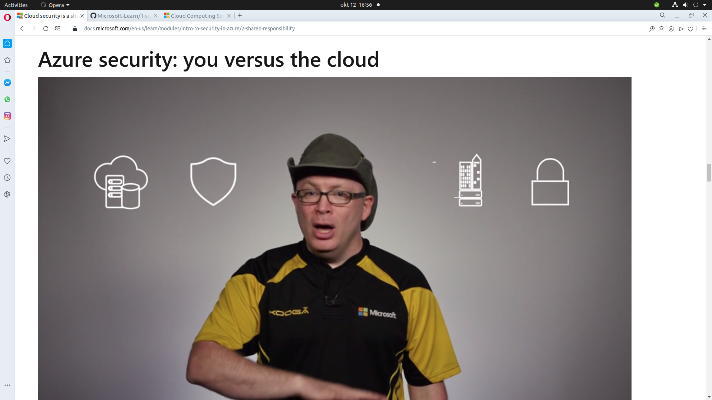

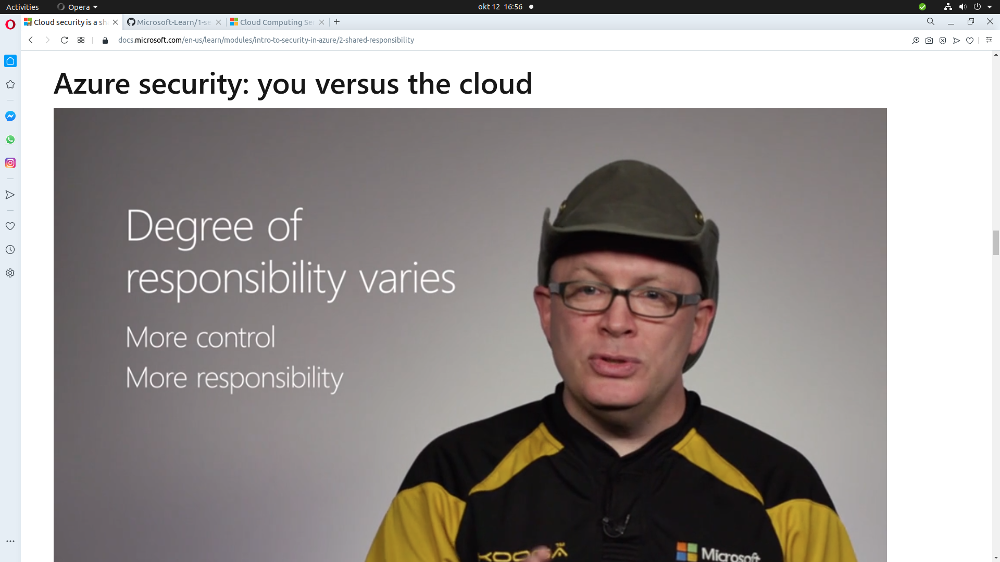

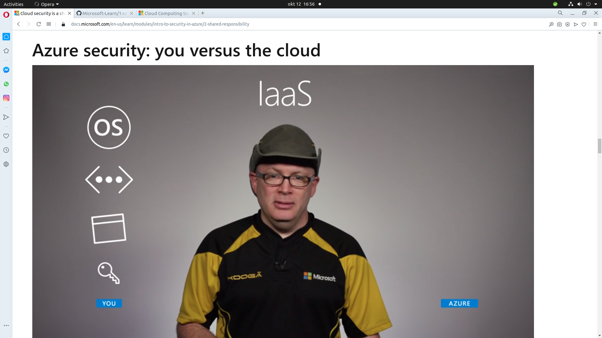

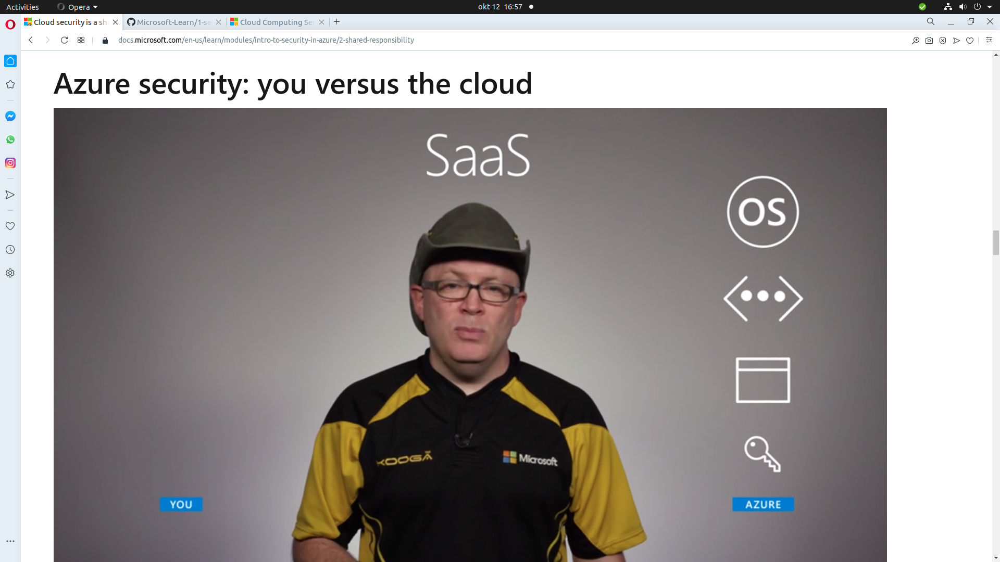

## A layered approach to security
Defense in depth is a strategy that employs a series of mechanisms to slow the advance of an attack aimed at acquiring unauthorized access to information. Each layer provides protection so that if one layer is breached, a subsequent layer is already in place to prevent further exposure. Microsoft applies a layered approach to security, both in physical data centers and across Azure services. The objective of defense in depth is to protect and prevent information from being stolen by individuals who are not authorized to access it.

Defense in depth can be visualized as a set of concentric rings, with the data to be secured at the center. Each ring adds an additional layer of security around the data. This approach removes reliance on any single layer of protection and acts to slow down an attack and provide alert telemetry that can be acted upon, either automatically or manually. Let's take a look at each of the layers.

## A layered approach to security

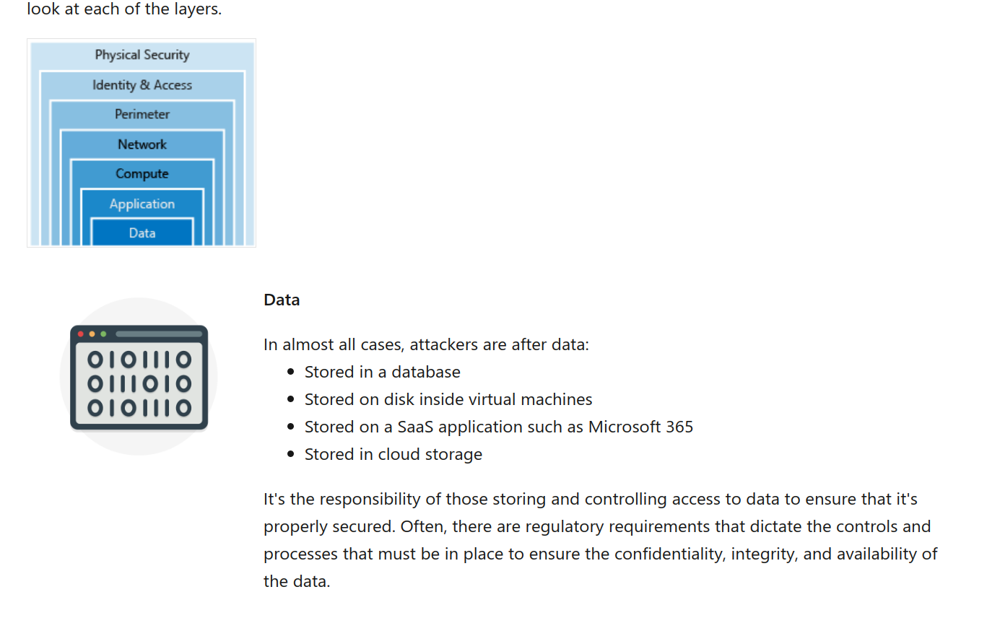
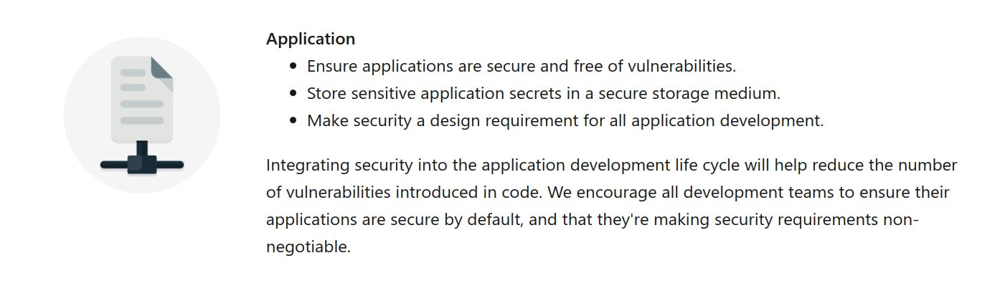
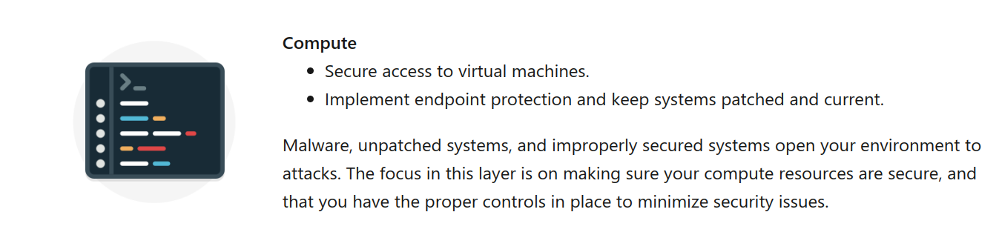
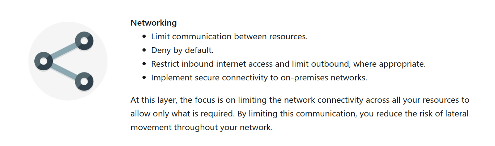
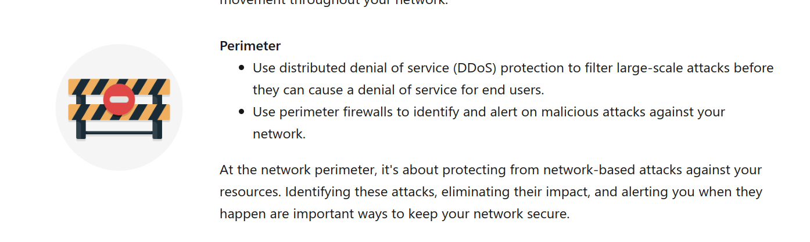
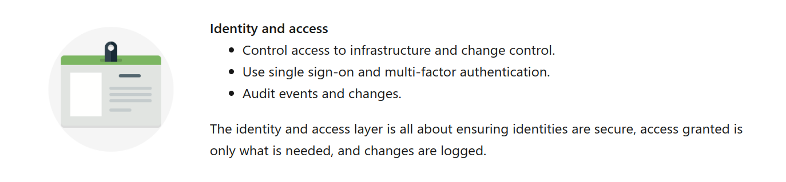
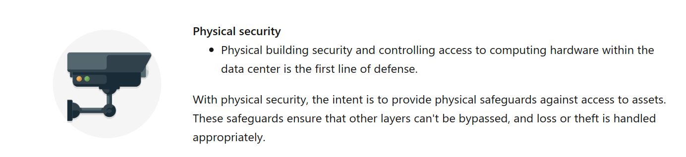

Azure helps alleviate your security concerns. But security is still a shared responsibility. How much of that responsibility falls on us depends on which model we use with Azure. We use the defense in depth rings as a guideline for considering what protections are adequate for our data and environments.

Next unit: Get tips from Azure Security Center

