## 1 security, responsibility, and trust in Azure

[Introduction](https://docs.microsoft.com/en-us/learn/modules/intro-to-security-in-azure/1-introduction)

Every system, architecture, and application needs to be designed with security in mind. There's too much at risk. For instance, a denial of service attack could prevent your customer from reaching your web site or services and block you from doing business. Defacement of your website damages your reputation. And a data breach could be even worse — as it can ruin hard-earned trust, while causing significant personal and financial harm. As administrators, developers, and IT management, we all must work to guarantee the security of our systems.
Let's say you work at a company called Contoso Shipping, and you're spearheading the development of drone deliveries in rural areas-while having truck drivers leverage mobile apps to deliver to urban areas. You're in the process of moving much of Contoso Shipping's infrastructure to the cloud to maximize efficiency, as well as moving several physical servers in the company's data center to Azure virtual machines. Your team plans on creating a hybrid solution, with some of the servers remaining on-premises, so you'll need a secure, high-quality connection between the new virtual machines and the existing network.

Additionally, Contoso Shipping has some out-of-network devices that are part of your operations. You are using network-enabled sensors in your drones that send data to Azure Event Hubs, while delivery drivers use mobile apps to get route maps and record signatures for receipt of shipments. These devices and apps must be securely authenticated before data can be sent to or from them.

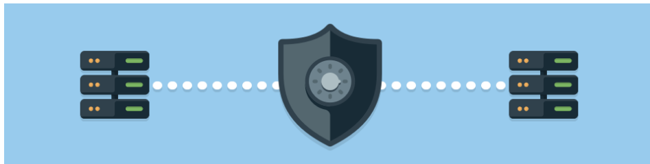

Additionally, Contoso Shipping has some out-of-network devices that are part of your operations. You are using network-enabled sensors in your drones that send data to Azure Event Hubs, while delivery drivers use mobile apps to get route maps and record signatures for receipt of shipments. These devices and apps must be securely authenticated before data can be sent to or from them.

So how do you keep your data secure?

Azure Event Hubs allow you to receive and process millions of events of real-time data each second via dynamic data pipelines. Event Hubs also integrates seamlessly with other Azure services.

Learning objectives

|In this module, you will learn how:|
|-----------------------------------------------|
|Security responsibility is shared with Azure|
|Identity management provides protection, even outside your network|
|Encryption capabilities built into Azure can protect your data|
|To protect your network and virtual networks|

Prerequisites
None

Next unit: Cloud security is a shared responsibility

## Cloud security is a shared responsibility
11 minutes
Organizations face many challenges with securing their datacenters, including recruiting and keeping security experts, using many security tools, and keeping pace with the volume and complexity of threats. As computing environments move from customer-controlled datacenters to the cloud, the responsibility of security also shifts. Security of the operational environment is now a concern shared by both cloud providers and customers. By shifting these responsibilities to a cloud service like Azure, organizations can reduce focus on activities that aren't core business competencies. Depending on the specific technology choices, some security protections will be built into the particular service, while addressing others will remain the customer's responsibility. To ensure that the proper security controls are provided, a careful evaluation of the services and technology choices becomes necessary.

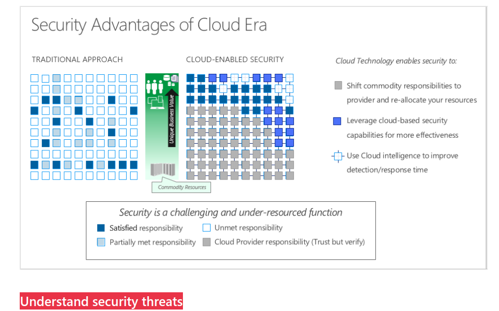

## Security is a shared responsibility

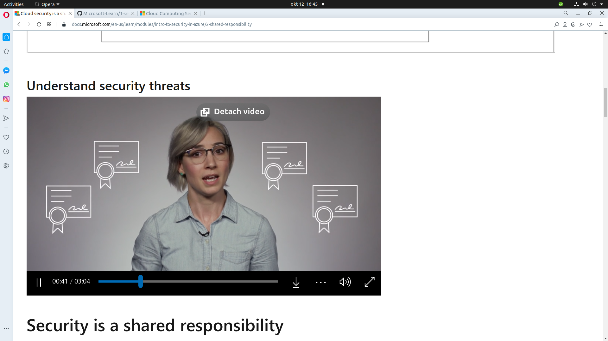
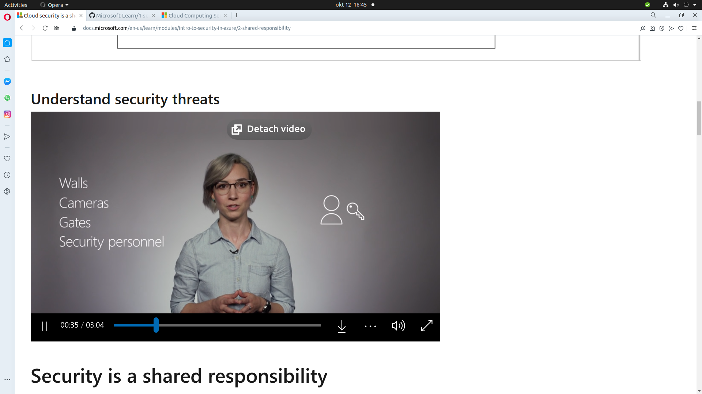
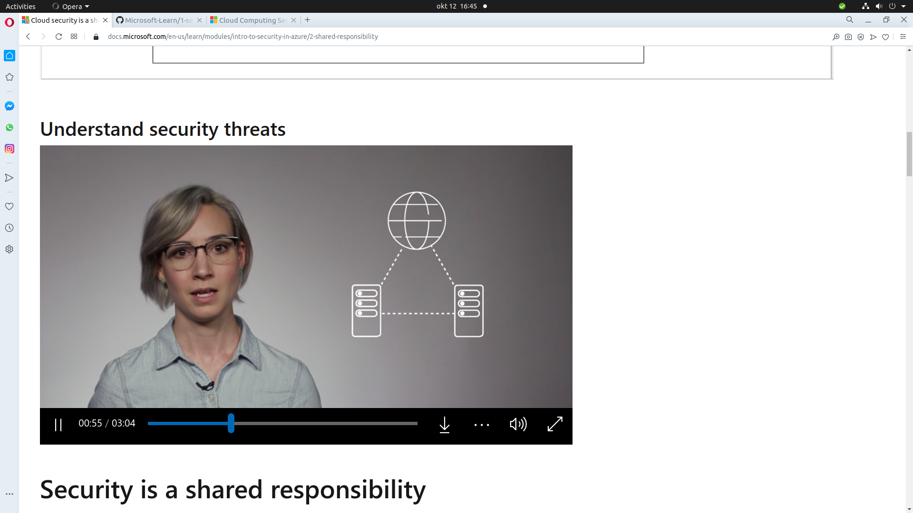
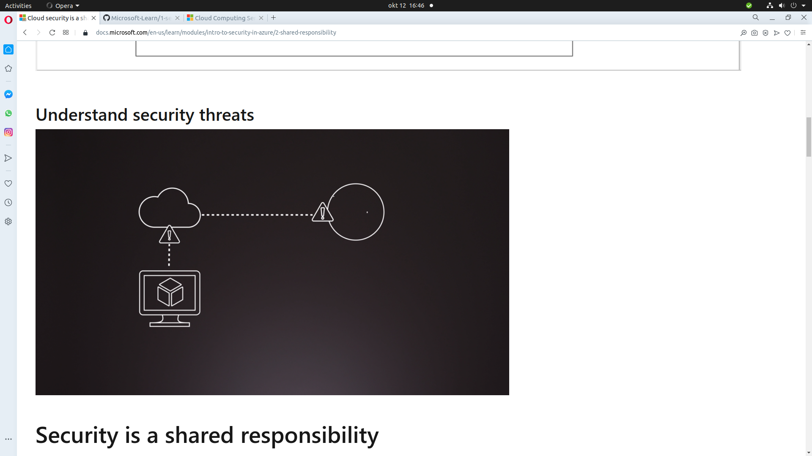
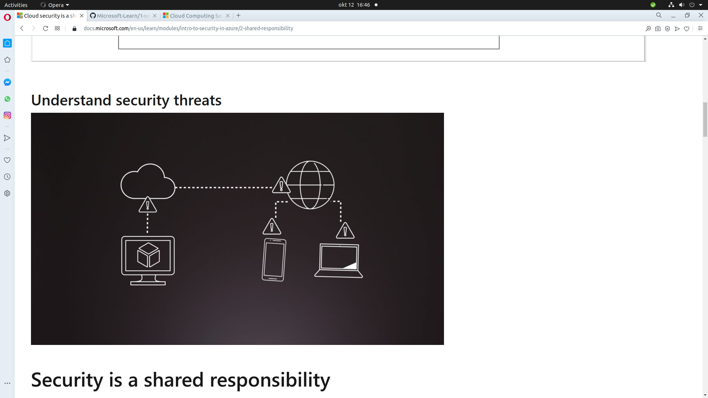
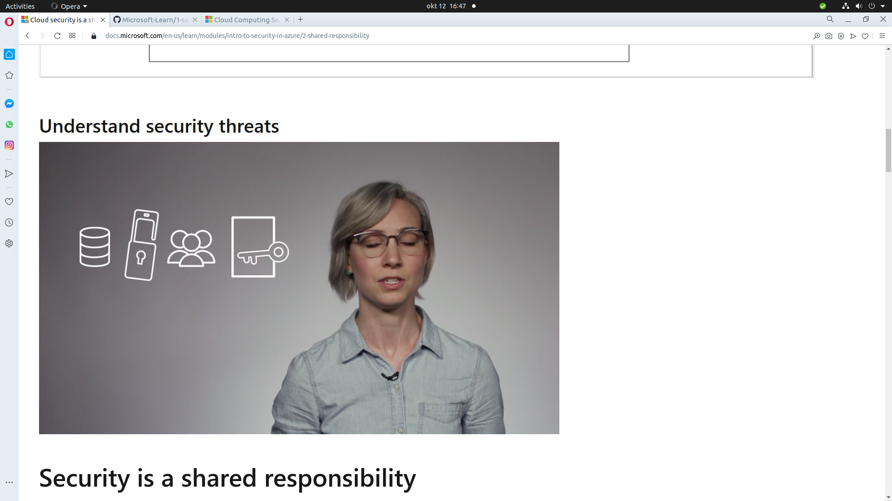
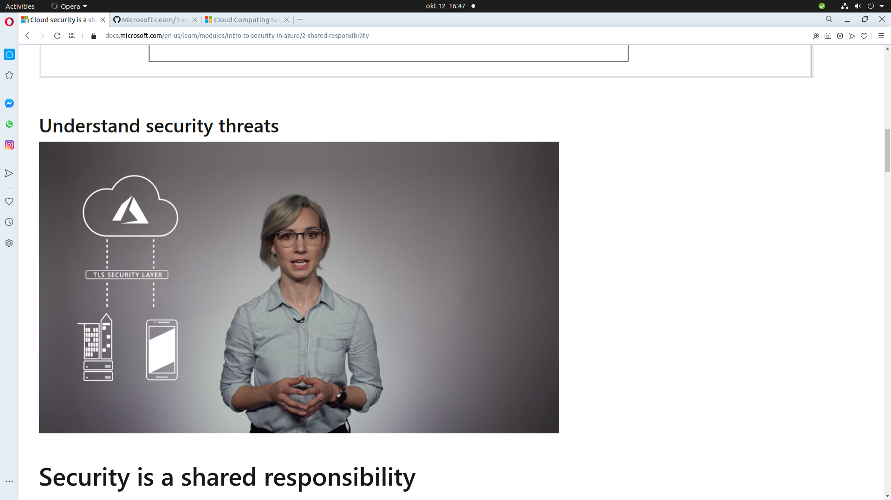
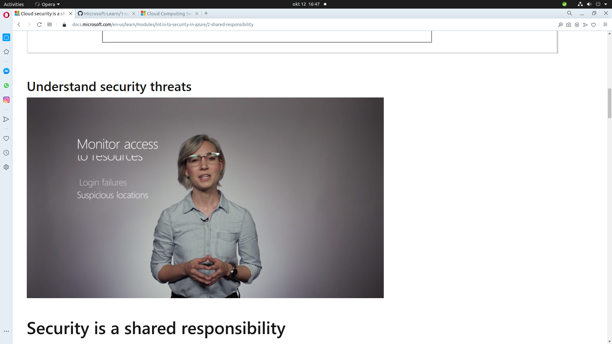
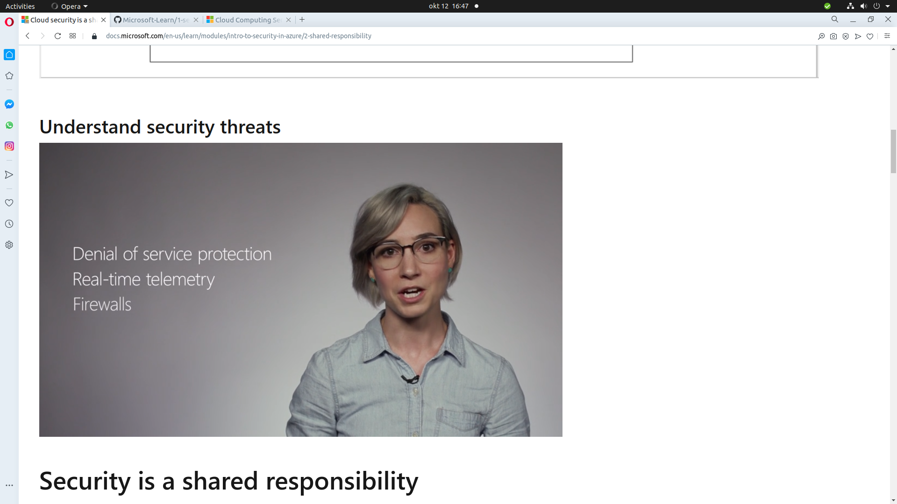