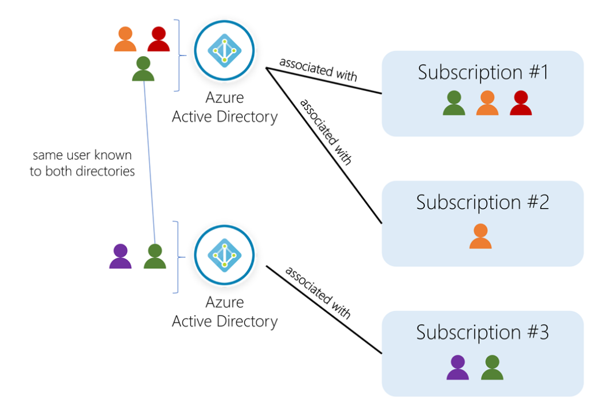
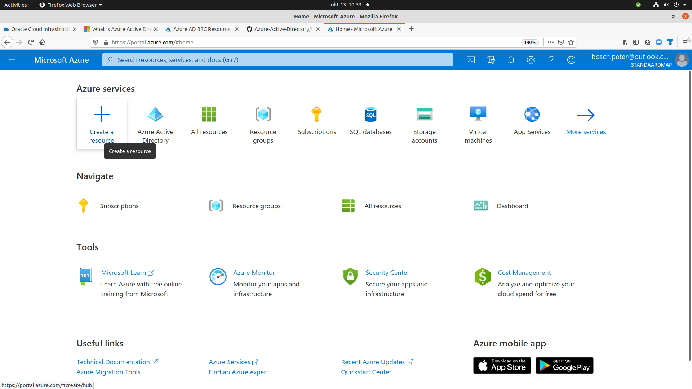
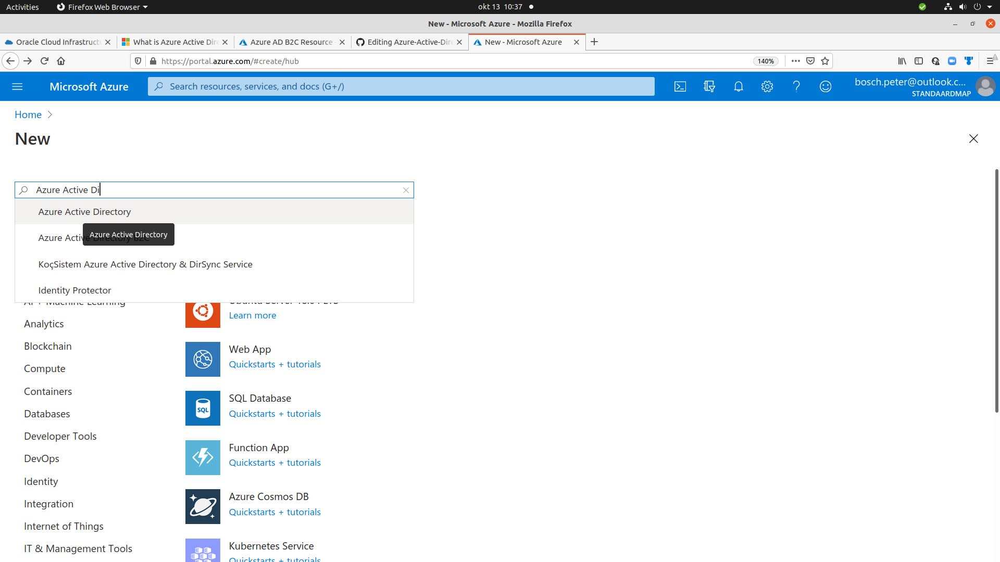
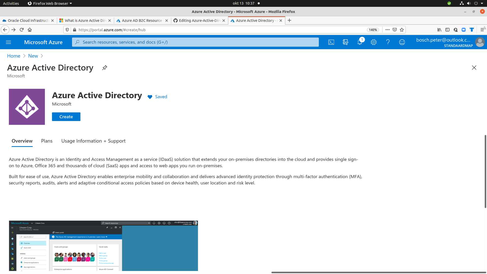
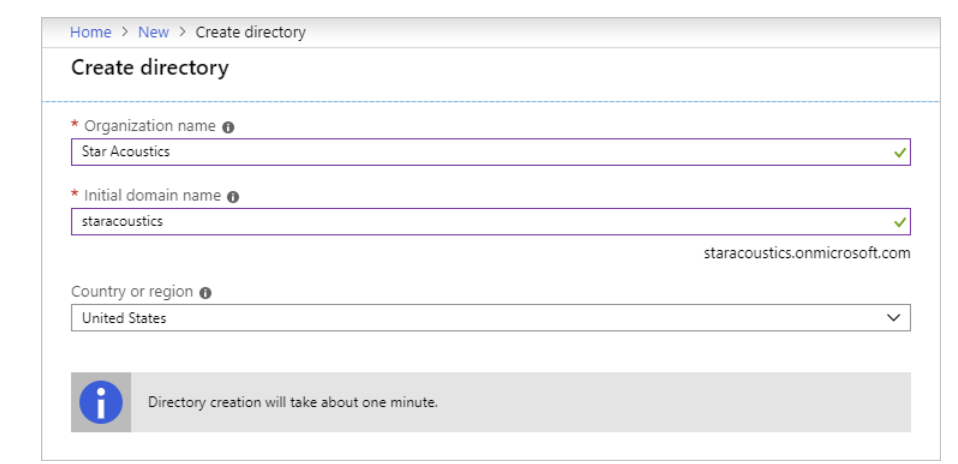
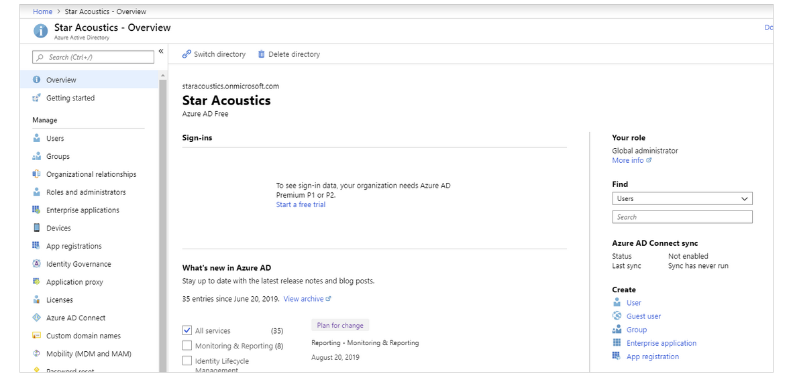

## 3 Manage users and groups in Azure Active Directory

[manage-users-and-groups-in-aad](https://docs.microsoft.com/en-us/learn/modules/manage-users-and-groups-in-aad/)

Manage users and groups in Azure Active Directory
Learning objectives

|In this module, you will|
|---------------------------------------------------|
|Learn the difference between Azure AD and Windows Server Active Directory|
|Understand tenants, subscriptions, and users|
|Create a new Azure Active Directory|
|Add users and groups to an Azure AD|
|Manage roles in an Azure AD|
|Learn how to create a hybrid identity solution with Azure AD Connect|


|1|3 min|[Introduction](https://docs.microsoft.com/en-us/learn/modules/manage-users-and-groups-in-aad/1-introduction)|
|2|10 min|[What is Azure Active Directory?](https://docs.microsoft.com/en-us/learn/modules/manage-users-and-groups-in-aad/2-create-aad)|
|3|8 min|[Create and manage users](https://docs.microsoft.com/en-us/learn/modules/manage-users-and-groups-in-aad/3-users)|
|4|8 min|[Create and manage groups](https://docs.microsoft.com/en-us/learn/modules/manage-users-and-groups-in-aad/4-groups)|
|5|10 min|[Use roles to control resource access](https://docs.microsoft.com/en-us/learn/modules/manage-users-and-groups-in-aad/5-manage-aad-roles)|
|6|8 min|[Connect Active Directory to Azure AD with Azure AD Connect](https://docs.microsoft.com/en-us/learn/modules/manage-users-and-groups-in-aad/|7-azure-ad-connect)|
|7|3 min|[Summary](https://docs.microsoft.com/en-us/learn/modules/manage-users-and-groups-in-aad/7-summary)|


## What is Azure Active Directory?

 10 minutes

While they share a similar name, Azure AD is not a cloud version of Windows Server Active Directory. It's also not intended as a complete replacement for an on-premises Active Directory. Instead, if you are already using a Windows AD server, you can connect it to Azure AD to extend your directory into Azure. This approach allows users to use the same credentials to access local and cloud-based resources.


Azure AD can also be used independently of Windows AD. Smaller companies can use Azure AD as their only directory service, using it to control access to their applications and SaaS products such as Microsoft 365, Salesforce, and Dropbox.

Note

Keep in mind that this approach doesn't provide a completely centralized administrative model - for example, local Windows machines would authenticate using local credentials. But applications can be written to use Azure AD to provide authentication and authorization that can then be administered in a single place.
Directories, subscriptions, and users

Microsoft offers several cloud-based offerings today - all of which can use Azure AD to identify users and control access.

|cloud-based offerings today |
|----------------------------|
|Microsoft Azure|
|Microsoft 365|
|Microsoft Intune|
|Microsoft Dynamics 365|

When a company or organization signs up to use one of these offerings, they are assigned a default directory, which is an instance of Azure AD. This directory holds the users and groups that will have access to each of the services the company has signed up for. This default directory is sometimes referred to as a tenant. A tenant represents the organization and the default directory assigned to it.

Subscriptions in Azure are both a billing entity and a security boundary. Resources such as virtual machines, web sites, and databases are always associated to a single subscription. Each subscription also has a single account owner who is responsible for any charges incurred by resources in that subscription. If your organization wants the subscription to be billed to another account, you can transfer ownership of the subscription. A given subscription is also associated to a single Azure AD directory. Multiple subscriptions can trust the same directory, but a subscription can only trust one directory.

Users and groups can be added to multiple subscriptions - this allows the user to create, control, and access resources in the subscription. When you add a user to a subscription, the user must be known to the associated directory as shown in the following image.

Conceptual art showing users, directories, and subscriptions in Azure




If you belong to multiple directories, you can switch the current directory you are working in through the Directory + subscription button in the Azure portal header.

 always has one default Azure AD directory it's associated with, however owners can create additional directories to support development or testing purposes, or because they want to have separate directories to synchronize with their local Windows Server AD forests.

Important
The steps to create a new directory are shown below, however unless you are an owner of your Azure account, this option won't be available to you. The Azure Sandbox doesn't allow you to create new Azure AD directories.


|step| the steps to create a new directory |
|------|------------------------------------------------------|
|1|Sign into the Azure portal .|




|------|------------------------------------------------------|
|2|Select Create a resource from the left sidebar, Identity from the Azure Marketplace, and then Azure Active Directory from the list.|




````
Azure Active Directory is an Identity and Access Management as a service (IDaaS) solution that extends your on-premises directories into the cloud and provides single sign-on to Azure, Office 365 and thousands of cloud (SaaS) apps and access to web apps you run on-premises.
Built for ease of use, Azure Active Directory enables enterprise mobility and collaboration and delivers advanced identity protection through multi-factor authentication (MFA), security reports, audits, alerts and adaptive conditional access policies based on device health, user location and risk level.
````




|------|------------------------------------------------------|
|3|Choose a name for the directory that will help distinguish it from your other directories. If the directory you're creating is to be used in production, choose a name for the directory that your users will recognize as the name of your organization. You can change the name later if you want.|
|4|Enter the domain name associated with it. The domain must not be known to Azure or you will get a validation error. The default domain name will always have the suffix .onmicrosoft.com. While this default domain cannot be changed, later you can add a custom domain owned by your organization so defined users can use a traditional company email such as john@contoso.com.|
|5|Select the country the directory should reside in. This will identify the region and data center where the Azure AD instance will live and it cannot be changed later.|
|6|Select Create to create the new directory. This will create a free tier directory where you can add users, create roles, register apps and devices, and control licenses.|




Once the directory is created, you can navigate to the dashboard that lets you control all aspects of the directory.



## Check your knowledge

|1. An Azure subscription is a _______________.|
|-----------------------------------------------------|
|x billing entity and security boundary|
|container that holds users|
|monthly charge for Azure services|

|2.Which of the following best describes the relationship between a subscription and an Azure AD directory?|
|-----------------------------------------------------|
|An Azure AD directory has a 1:1 relationship with a subscription.|
|# An Azure AD directory can be associated with multiple subscriptions, but a subscription is always tied to a single directory.|
|An Azure AD directory is associated with a single subscription, but a subscription can trust multiple directories.|

|3. True or False, an organization can have more than one Azure AD directory.|
|-----------------------------------------------------|
|xTrue|
|False|


![tt](../../pictures/congratulations_aad.png

