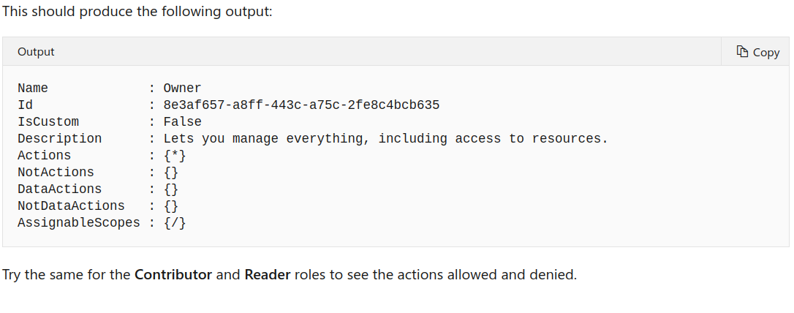

## 3 Manage users and groups in Azure Active Directory

[manage-users-and-groups-in-aad](https://docs.microsoft.com/en-us/learn/modules/manage-users-and-groups-in-aad/)

Manage users and groups in Azure Active Directory
Learning objectives

|In this module, you will|
|---------------------------------------------------|
|Learn the difference between Azure AD and Windows Server Active Directory|
|Understand tenants, subscriptions, and users|
|[Create a new Azure Active Directory](https://docs.microsoft.com/en-us/learn/modules/manage-users-and-groups-in-aad/2-create-aad)|
|Add users and groups to an Azure AD|
|Manage roles in an Azure AD|
|Learn how to create a hybrid identity solution with Azure AD Connect|


|1|3 min|[Introduction](https://docs.microsoft.com/en-us/learn/modules/manage-users-and-groups-in-aad/1-introduction)|
|2|10 min|[What is Azure Active Directory?](https://docs.microsoft.com/en-us/learn/modules/manage-users-and-groups-in-aad/2-create-aad)|
|3|8 min|[Create and manage users](https://docs.microsoft.com/en-us/learn/modules/manage-users-and-groups-in-aad/3-users)|
|4|8 min|[Create and manage groups](https://docs.microsoft.com/en-us/learn/modules/manage-users-and-groups-in-aad/4-groups)|
|5|10 min|[Use roles to control resource access](https://docs.microsoft.com/en-us/learn/modules/manage-users-and-groups-in-aad/5-manage-aad-roles)|
|6|8 min|[Connect Active Directory to Azure AD with Azure AD Connect](https://docs.microsoft.com/en-us/learn/modules/manage-users-and-groups-in-aad/|7-azure-ad-connect)|
|7|3 min|[Summary](https://docs.microsoft.com/en-us/learn/modules/manage-users-and-groups-in-aad/7-summary)|


## What is Azure Active Directory?

 10 minutes

While they share a similar name, Azure AD is not a cloud version of Windows Server Active Directory. It's also not intended as a complete replacement for an on-premises Active Directory. Instead, if you are already using a Windows AD server, you can connect it to Azure AD to extend your directory into Azure. This approach allows users to use the same credentials to access local and cloud-based resources.


Azure AD can also be used independently of Windows AD. Smaller companies can use Azure AD as their only directory service, using it to control access to their applications and SaaS products such as Microsoft 365, Salesforce, and Dropbox.

Note

Keep in mind that this approach doesn't provide a completely centralized administrative model - for example, local Windows machines would authenticate using local credentials. But applications can be written to use Azure AD to provide authentication and authorization that can then be administered in a single place.
Directories, subscriptions, and users

Microsoft offers several cloud-based offerings today - all of which can use Azure AD to identify users and control access.

|cloud-based offerings today |
|----------------------------|
|Microsoft Azure|
|Microsoft 365|
|Microsoft Intune|
|Microsoft Dynamics 365|

When a company or organization signs up to use one of these offerings, they are assigned a default directory, which is an instance of Azure AD. This directory holds the users and groups that will have access to each of the services the company has signed up for. This default directory is sometimes referred to as a tenant. A tenant represents the organization and the default directory assigned to it.

Subscriptions in Azure are both a billing entity and a security boundary. Resources such as virtual machines, web sites, and databases are always associated to a single subscription. Each subscription also has a single account owner who is responsible for any charges incurred by resources in that subscription. If your organization wants the subscription to be billed to another account, you can transfer ownership of the subscription. A given subscription is also associated to a single Azure AD directory. Multiple subscriptions can trust the same directory, but a subscription can only trust one directory.

Users and groups can be added to multiple subscriptions - this allows the user to create, control, and access resources in the subscription. When you add a user to a subscription, the user must be known to the associated directory as shown in the following image.

Conceptual art showing users, directories, and subscriptions in Azure


If you belong to multiple directories, you can switch the current directory you are working in through the Directory + subscription button in the Azure portal header.

 always has one default Azure AD directory it's associated with, however owners can create additional directories to support development or testing purposes, or because they want to have separate directories to synchronize with their local Windows Server AD forests.

Important
[The steps to create a new directory are shown below](https://docs.microsoft.com/en-us/learn/modules/manage-users-and-groups-in-aad/2-create-aad), however unless you are an owner of your Azure account, this option won't be available to you. The Azure Sandbox doesn't allow you to create new Azure AD directories.


|step| the steps to create a new directory |
|------|------------------------------------------------------|
|1|Sign into the Azure portal .|


|step| the steps to create a new directory |
|------|------------------------------------------------------|
|2|Select Create a resource from the left sidebar, Identity from the Azure Marketplace, and then Azure Active Directory from the list.|


````
Azure Active Directory is an Identity and Access Management as a service (IDaaS) solution that extends your on-premises directories into the cloud and provides single sign-on to Azure, Office 365 and thousands of cloud (SaaS) apps and access to web apps you run on-premises.
Built for ease of use, Azure Active Directory enables enterprise mobility and collaboration and delivers advanced identity protection through multi-factor authentication (MFA), security reports, audits, alerts and adaptive conditional access policies based on device health, user location and risk level.
````


|step| the steps to create a new directory |
|------|------------------------------------------------------|
|3|Choose a name for the directory that will help distinguish it from your other directories. If the directory you're creating is to be used in production, choose a name for the directory that your users will recognize as the name of your organization. You can change the name later if you want.|


|step| the steps to create a new directory |
|------|------------------------------------------------------|
|4|Enter the domain name associated with it. The domain must not be known to Azure or you will get a validation error. The default domain name will always have the suffix .onmicrosoft.com. While this default domain cannot be changed, later you can add a custom domain owned by your organization so defined users can use a traditional company email such as john@contoso.com.|


|step| the steps to create a new directory |
|------|------------------------------------------------------|
|5|Select the country the directory should reside in. This will identify the region and data center where the Azure AD instance will live and it cannot be changed later.|


|step| the steps to create a new directory |
|------|------------------------------------------------------|
|6|Select Create to create the new directory. This will create a free tier directory where you can add users, create roles, register apps and devices, and control licenses.|


Once the directory is created, you can navigate to the dashboard that lets you control all aspects of the directory.


## Check your knowledge

|1. An Azure subscription is a _______________.|
|-----------------------------------------------------|
|x billing entity and security boundary|
|container that holds users|
|monthly charge for Azure services|

|2.Which of the following best describes the relationship between a subscription and an Azure AD directory?|
|-----------------------------------------------------|
|An Azure AD directory has a 1:1 relationship with a subscription.|
|# An Azure AD directory can be associated with multiple subscriptions, but a subscription is always tied to a single directory.|
|An Azure AD directory is associated with a single subscription, but a subscription can trust multiple directories.|

|3. True or False, an organization can have more than one Azure AD directory.|
|-----------------------------------------------------|
|xTrue|
|False|


Next unit: Create and manage users

## Create and manage users

    8 minutes

Every user who needs access to Azure resources needs an Azure user account. A user account contains all the information needed to authenticate the user during the sign-on process. Once authenticated, Azure AD builds an access token to authorize the user and determine what resources they can access and what they can do with those resources.

You use the Azure Active Directory dashboard in the Azure portal to work with user objects. Keep in mind that you can only work with a single directory at a time - but you can use the Directory + Subscription panel to switch directories. The dashboard also has a Switch directory button in the toolbar which makes it easy to switch to another available director


## Viewing users

To view the Azure AD users, select the Users entry under the Manage group - this will open the All Users view. Take a minute to access the portal and view your users. Notice the USER TYPE and SOURCE columns, as the following figure depicts.

Screenshot that depicts the All users pane, with the USER TYPE and SOURCE columns noted.


|way|Typically, Azure AD defines users in three ways:|
|-------------------|-------------------------------------------------------------------|
|Cloud identities -| These users exist only in Azure AD. Examples are administrator accounts and users that you manage yourself. Their source is Azure Active Directory or External Azure Active Directory if the user is defined in another Azure AD instance but needs access to subscription resources controlled by this directory. When these accounts are removed from the primary directory, they are deleted.
|  Directory-synchronized identities |- These users exist in an on-premises Active Directory. A synchronization activity that occurs via Azure AD Connect brings these users in to Azure. Their source is Windows Server AD.|
|Guest users -| These users exist outside Azure. Examples are accounts from other cloud providers and Microsoft accounts such as an Xbox LIVE account. Their source is Invited user. This type of account is useful when external vendors or contractors need access to your Azure resources. Once their help is no longer necessary, you can remove the account and all of their access.|


Azure AD provides several built-in roles to cover the most common security scenarios. To understand how the roles work, let's examine three roles that apply to all resource types:

Owner, which has full access to all resources, including the right to delegate access to others.
Contributor, which can create and manage all types of Azure resources but can’t grant access to others.
Reader, which can view existing Azure resources.
Role definitions
Each role is a set of properties defined in a JavaScript Object Notation (JSON) file. This role definition includes a Name, Id, and Description. It also includes the allowable permissions (Actions), denied permissions (NotActions), and scope (for example, read access) for the role.
For the Owner role, that means all actions, indicated by an asterisk (*); no denied actions; and all scopes, indicated by a forward slash (/).
You can get this information using the Powershell Get-AzureRmRoleDefinition cmdlet. Try typing the following command into the Cloud Shell on the right.


Examine the built-in roles

|Next, let's explore some of the other built-in roles.|
|----------------------------------------------|
|Open the Azure portal |
|Select Resource groups from the left sidebar.|

 item from the sidebar menu.|

|Next, let's explore some of the other built-in roles.|
|----------------------------------------------|
|Select the Roles tab as shown below to see the list of available roles.|


## Adding users
You can add cloud identities to Azure AD in multiple ways:

## Syncing an on-premises Windows Server Active Directory
Azure AD Connect is a separate service that allows you to synchronize a traditional Active Directory with your Azure AD instance. This is how most enterprise customers add users to the directory. The advantage to this approach is users can use single-sign-on (SSO) to access local and cloud-based resources.


## https://endpoint.microsoft.com


In addition to Name and User name, you can add profile information, like Job Title and Department.


The default behavior is to create a new user in the organization. The user will have a username with the default domain name assigned to the directory such as alice@staracoustics.onmicrosoft.com.

You can also invite a user into the directory. In this case, an email is sent to a known email address and an account is created and associated with that email address if they accept the invitation.


The invited user will need to create an associated Microsoft account (MSA) if that specific email address isn't associated with one and the account will be added to the Azure AD as a guest user.

## Use the command line
If you have a lot of users to add, a better option is to use a command-line tool. You can use the New-AzureADUser Azure PowerShell command to add cloud-based users.

````
# Create a password object
$PasswordProfile = New-Object -TypeName Microsoft.Open.AzureAD.Model.PasswordProfile

# Assign the password
$PasswordProfile.Password = "<Password>"

# Create the new user
New-AzureADUser -AccountEnabled $True -DisplayName "Abby Brown" -PasswordProfile $PasswordProfile -MailNickName "AbbyB" -UserPrincipalName "AbbyB@contoso.com"
````

````
The command will return the new user object you created.
Output
Copy
ObjectId                             DisplayName UserPrincipalName UserType
--------                             ----------- ----------------- --------
f36634c8-8a93-4909-9248-0845548bc515 Abby Brown  AbbyB@contoso.com Member
````


If you prefer a more traditional command-line, you can use the Azure CLI:

````
az ad user create --display-name "Abby Brown" \
                  --password "<password>" \
                  --user-principal-name "AbbyB@contoso.com" \
                  --force-change-password-next-login true \
                  --mail-nickname "AbbyB"
````


Command-line tools allow you to add users in bulk through scripting. The most common approach for this is to use a comma-separated values file (CSV). You can either manually create this file or export the file from an existing data source.

If you're planning to use a CSV, here are some things to think about:

Naming conventions. Establish or implement a naming convention for usernames, display names, and aliases. For example, a username might consist of the last name, followed by a period (.), followed by the first name—for example, Smith.John@contoso.com.

Passwords. Implement a convention for the initial password of a newly created user. Determine how new users will receive their passwords in a security-enhanced way. A commonly used method is generating a random password and then emailing it to the new user or their manager.

|To use a CSV with Azure PowerShell:|
|--------------------------------------------|
|Use Connect-AzureAD to create an Azure PowerShell connection to your directory. Connect with an admin account that has privileges on your directory.|
|Create new password profiles for the new users. The passwords for the new users need to conform to the password complexity rules you have set for your directory.|
|Use Import-CSV to import the CSV. You need to specify the path and file name of the CSV.|
|Loop through the users in the file, constructing the user parameters needed for each user. Example parameters are User Principal Name, Display Name, Given Name, ||Department, and Job Title.|

Use New-ADUser to create each user. Be sure to enable each account.

## Other options
You can also add users to Azure AD programmatically using the Azure AD Graph API, or through the Microsoft 365 Admin Center and the 
Microsoft Intune Admin console if you are sharing the same directory.

Next unit: Create and manage groups


## 4 Create Azure users and groups in Azure Active Directory


## Create and manage groups
8 minutes
An Azure AD group helps organize users making it easier to manage permissions. Using groups lets the resource owner (or Azure AD directory owner), assign a set of access permissions to all the members of the group, instead of having to provide the rights one-by-one. Groups allow us to define a security boundary and then add and remove specific users to grant or deny access with a minimum amount of effort. Even better, Azure AD supports the ability to define membership based on rules - such as what department a user works in, or the job title they have.

Azure AD allows you to define two different types of groups.

Security groups. These are the most common and are used to manage member and computer access to shared resources for a group of users. For example, you can create a security group for a specific security policy. By doing it this way, you can give a set of permissions to all the members at once, instead of having to add permissions to each member individually. This option requires an Azure AD administrator.

Microsoft 365 groups. These groups provide collaboration opportunities by giving members access to a shared mailbox, calendar, files, SharePoint site, and more. This option also lets you give people outside of your organization access to the group. This option is available to users as well as admins.

Viewing available groups
You can view all groups through the Groups item under the Manage group from the Azure AD dashboard. A new Azure AD install won't have any groups defined.


## Adding groups to Azure AD
The same options are available to create groups in Azure AD as we saw with users. The Azure portal is the easiest way to create groups. You must select the group type (Security or Microsoft 365), assign a unique group name, description and a membership type.


|The membership type field can be one of three values:|
|Assigned. The group will contain specific users or groups that you select.|
|Dynamic user. You create rules based on characteristics to enable attribute-based dynamic memberships for groups. For example, if a user’s department is Sales, that user will be dynamically assigned to the Sales group. You can set up a rule for dynamic membership on security groups or on Office 365 groups. If the user's department changes in the future, they are automatically removed from the group. This feature requires an Azure AD Premium P1 license.|
|Finally, you can select group owner(s) that can administer the group, and member(s) that will belong to the group. Both of these can contain other groups as well as individual users.|

## Scripting group creation
You can also use Azure PowerShell to add a group using the New-AzureADGroup command as shown below.

````
New-AzureADGroup -Description "Marketing" -DisplayName "Marketing" -MailEnabled $false -SecurityEnabled $true -MailNickName "Marketing"
````

## Changing the membership for a group
Once a group is created, you can add or remove users (or groups) from it by editing the group membership by selecting the group and using the options under the Manage section.


## Next unit: Use roles to control resource access

Use roles to control resource access
10 minutes
Built-in Roles for Azure Resources (USES POWERSHELL)
Azure AD provides several built-in roles to cover the most common security scenarios. To understand how the roles work, let's examine three roles that apply to all resource types:

Owner, which has full access to all resources, including the right to delegate access to others.
Contributor, which can create and manage all types of Azure resources but can’t grant access to others.
Reader, which can view existing Azure resources.
Role definitions
Each role is a set of properties defined in a JavaScript Object Notation (JSON) file. This role definition includes a Name, Id, and Description. It also includes the allowable permissions (Actions), denied permissions (NotActions), and scope (for example, read access) for the role.

For the Owner role, that means all actions, indicated by an asterisk (*); no denied actions; and all scopes, indicated by a forward slash (/).

You can get this information using the Powershell Get-AzureRmRoleDefinition cmdlet. Try typing the following command into the Cloud Shell on the right.

````
Get-AzureRmRoleDefinition -Name Owner
````




## Examine the built-in roles

|Next, let's explore some of the other built-in roles.|
|[Open the Azure portal](https://portal.azure.com/#home) |
|Select Resource groups from the left sidebar.|
|Select the resource group.|
|Select the Access control (IAM) item from the sidebar menu.|
|Select the Roles tab as shown below to see the list of available roles.|


## What's a role definition?
A role definition is a collection of permissions. It's sometimes just called a role. A role definition lists the operations that can be performed, such as read, write, and delete. It can also list the operations that can't be performed or operations related to underlying data.


This structure is represented as JSON when used in role-based access control (RBAC) or from the underlying API. For example, here's the Contributor role definition in JSON format.

````
{
  "Name": "Contributor",
  "Id": "b24988ac-6180-42a0-ab88-20f7382dd24c",
  "IsCustom": false,
  "Description": "Lets you manage everything except access to resources.",
  "Actions": [
    "*"
  ],
  "NotActions": [
    "Microsoft.Authorization/*/Delete",
    "Microsoft.Authorization/*/Write",
    "Microsoft.Authorization/elevateAccess/Action"
  ],
  "DataActions": [],
  "NotDataActions": [],
  "AssignableScopes": [
    "/"
  ]
}
````
## Actions and NotActions

You can tailor the Actions and NotActions properties to grant and deny the exact permissions you need. These are always in the format: {Company}.{ProviderName}/resourceType}/{action}.
As an example, here are the actions for the three roles we looked at previously.


he wildcard (*) operation under Actions indicates that the principal assigned to this role can perform all actions, or in other words, it can manage everything. This includes actions defined in the future, as Azure adds new resource types. In the case of the Reader role, only the read action is allowed.

The operations under NotActions are subtracted from Actions. In the case of the Contributor role, NotActions removes this role's ability to manage access to resources and also assign access to resources.

DataActions and NotDataActions
Data operations are specified in the DataActions and NotDataActions properties. This allows data operations to be specified separately from the management operations. This prevents current role assignments with wildcards (*) from suddenly having access to data. Here are some data operations that can be specified in DataActions and NotDataActions:

Read a list of blobs in a container
Write a storage blob in a container
Delete a message in a queue
Only data operations can be added to the DataActions and NotDataActions properties. Resource providers identify which operations are data operations by setting the isDataAction property to true. Roles that do not have data operations can omit these properties from the role definition.

These actions work exactly like their management cousins. You specify actions you want to allow (or * for all) and then provide a list of specific actions to remove in the NotDataActions collection. Here are some examples, you can find the [full list](https://docs.microsoft.com/en-us/azure/role-based-access-control/resource-provider-operations) of actions and data actions in the resource provider documentation:

Creating roles
As you can see, Azure AD comes with a bunch of built-in roles that likely cover 99% of what you'll ever want to do. You should prefer to use a built-in role if possible. However, you can create custom roles if you find it necessary to do so.

 Note

Custom role creation requires Azure AD Premium P1 or P2 and cannot be done in the free tier.
Creating a new role can be done through several mechanisms:
Azure portal. You can use the Azure portal to create a custom role - Azure Active Directory > Roles and administrators > New custom role.
Azure PowerShell. You can use the New-AzureADMSRoleDefinition cmdlet to define a new role.
Azure Graph API. You can use a REST call to the Graph API to programmatically create a new role.
The summary includes a link to the documentation for all three approaches.


