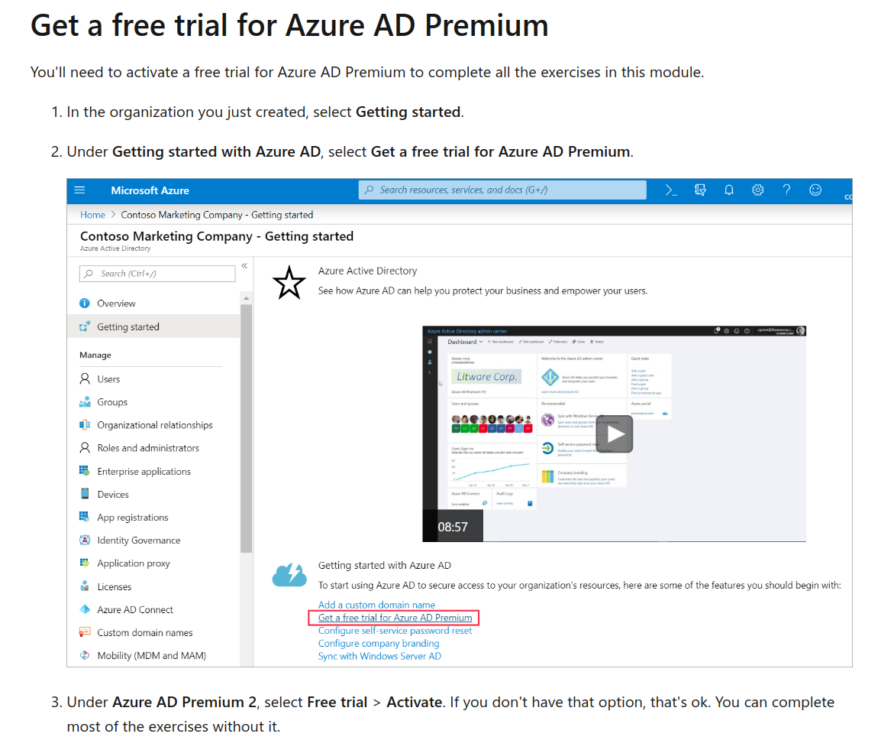
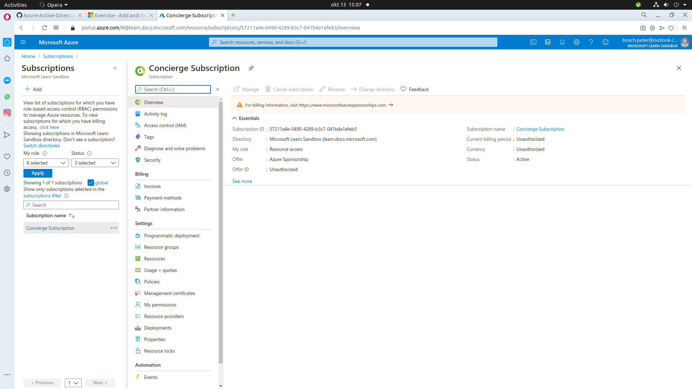
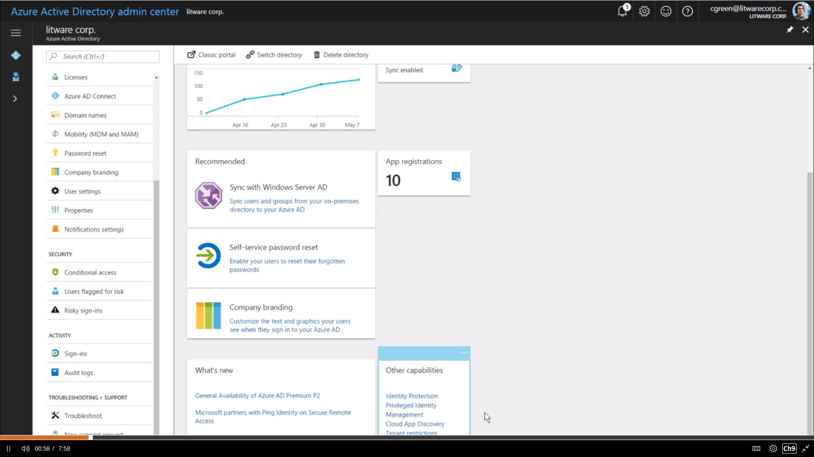
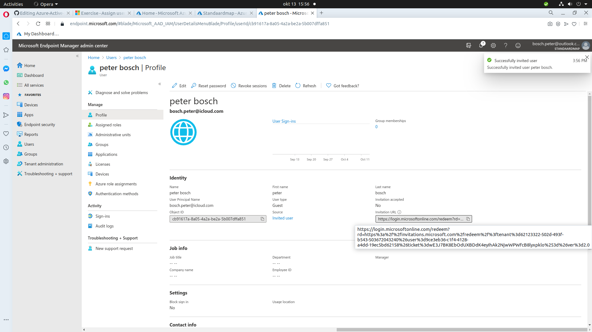

## Create Azure users and groups in Azure Active Directory

https://docs.microsoft.com/en-us/learn/modules/create-users-and-groups-in-azure-active-directory/


41 min Module 8 Units Beginner Administrator Azure Azure Active Directory
Create users in Azure Active Directory. Understand different types of groups. Create a group and add members. Manage business-to-business guest accounts.

Learning objectives
In this module, you will:

Add users to Azure Active Directory.
Manage app and resource access by using Azure Active Directory groups.
Give guest users access in Azure Active Directory business to business (B2B).
Prerequisites


This module is part of these learning paths
AZ-104: Manage identities and governance in Azure
Manage identity and access in Azure Active Directory
AZ-400: Develop a security and compliance plan

|duur| Create users in Azure Active Directory|
|-----|--------------------------------------------------|
|2 min| IntroductionManage identities and governance for Azure administrators|
|7 min| What are user accounts in Azure Active Directory?  Exercise - Add and delete users in Azure Active Directory|
|7 min| Manage app and resource access by using Azure Active Directory groups|
|3 min| Exercise - Assign users to Azure Active Directory groups|
|5 min| Collaborate by using guest accounts and Azure Active Directory B2B|
|10 min| Exercise - Give guest users access in Azure Active Directory B2B|
|2 min| Summary|

ntroduction
2 minutes
You're a global administrator in Azure Active Directory for a marketing organization. Your organization recently added a small developer team to build a new website hosted on Azure. You're also partnering with an external organization to design the website. You've been asked to add the new developer team to the organization's Azure Active Directory. To make it easier for the teams to collaborate on the website, you'll create guest accounts in Azure Active Directory for the external design organization.

Learning objectives
At the end of this module, you'll be able to:

## Add users to Azure Active Directory.
Manage app and resource access by using Azure Active Directory groups.
Give guest users access in Azure Active Directory business to business (B2B).
Prerequisites
None

Next unit: What are user accounts in Azure Active Directory

What are user accounts in Azure Active Directory?
7 minutes
In Azure Active Directory (Azure AD), all user accounts are granted a set of default permissions. A user's account access consists of the type of user, their role assignments, and their ownership of individual objects.

There are different types of user accounts in Azure AD. Each type has a level of access specific to the scope of work expected to be done under each type of user account. Administrators have the highest level of access, followed by the member user accounts in the Azure AD organization. Guest users have the most restricted level of access.

Permissions and roles
Azure AD uses permissions to help you control the access rights a user or group is granted. This is done through roles. Azure AD has many roles with different permissions attached to them. When a user is assigned a specific role, they inherit permissions from that role. For example, a user assigned to the User Administrator role can create and delete user accounts.

Understanding when to assign the correct type of role to the right user is a fundamental and crucial step in maintaining privacy and security compliance. If the wrong role is assigned to the wrong user, the permissions that come with that role can allow the user to cause serious damage to an organization.

Administrator roles
Administrator roles in Azure AD allow users elevated access to control who is allowed to do what. You assign these roles to a limited group of users to manage identity tasks in an Azure AD organization. You can assign administrator roles that allow a user to create or edit users, assign administrative roles to others, reset user passwords, manage user licenses, and more.

If your user account has the User Administrator or Global Administrator role, you can create a new user in Azure AD by using either the Azure portal, the Azure CLI, or PowerShell. In PowerShell, use the cmdlet New-AzureADUser. In the Azure CLI, use az ad user create.

Member users
A member user account is a native member of the Azure AD organization that has a set of default permissions like being able to manage their profile information. When someone new joins your organization, they typically have this type of account created for them.

Anyone who isn't a guest user or isn't assigned an administrator role falls into this type. A member user is meant for users who are considered internal to an organization and are members of the Azure AD organization. However, these users shouldn't be able to manage other users by, for example, creating and deleting users. Member users don't have the same restrictions that are typically placed on guest users.

Guest users
Guest users have restricted Azure AD organization permissions. When you invite someone to collaborate with your organization, you add them to your Azure AD organization as a guest user. Then you can either send an invitation email that contains a redemption link or send a direct link to an app you want to share. Guest users sign in with their own work, school, or social identities. By default, Azure AD member users can invite guest users. This default can be disabled by someone who has the User Administrator role.

Your organization might need to work with an external partner. To collaborate with your organization, these partners often need to have a certain level of access to specific resources. For this sort of situation, it's a good idea to use guest user accounts. You'll then make sure partners have the right level of access to do their work, without having a higher level of access than they need.

Add user accounts
You can add individual user accounts through the Azure portal, Azure PowerShell, or the Azure CLI.

If you want to use the Azure CLI, use the following cmdlet:

````
# create a new user
az ad user create

````

This command creates a new user by using the Azure CLI.
For Azure PowerShell, use the following cmdlet:

````
# create a new user
New-AzureADUser
````

You can bulk create member users and guests accounts. The following example shows how to bulk invite guest users.

````
$invitations = import-csv c:\bulkinvite\invitations.csv

$messageInfo = New-Object Microsoft.Open.MSGraph.Model.InvitedUserMessageInfo

$messageInfo.customizedMessageBody = "Hello. You are invited to the Contoso organization."

foreach ($email in $invitations)
   {New-AzureADMSInvitation `
      -InvitedUserEmailAddress $email.InvitedUserEmailAddress `
      -InvitedUserDisplayName $email.Name `
      -InviteRedirectUrl https://myapps.microsoft.com `
      -InvitedUserMessageInfo $messageInfo `
      -SendInvitationMessage $true
   }
````


You create the comma-separated values (CSV) file with the list of all the users you want to add. An invitation is sent to each user in that CSV file.

Delete user accounts
You can also delete user accounts through the Azure portal, Azure PowerShell, or the Azure CLI. In PowerShell, use the cmdlet Remove-AzureADUser. In the Azure CLI, use the cmdlet az ad user delete.

When you delete a user, the account remains in a suspended state for 30 days. During that 30-day window, the user account can be restored.Check your knowledge

|1. If you delete a user account by mistake, can it be restored?|
|----------------------------------------------------------------------|
|When a user account is deleted, it's gone forever and can't be restored.|
|the user account can be restored, but only when it's created within the last 30 days.|
|xThe user account can be restored, but only when it's deleted within the last 30 days.|

|2. What kind of account would you create to allow an external organization easy access?|
|--------------------------------------------------------|
|xA guest user account for each member of the external team.|
|An external account for each member of the external team.|
|An administrator account for each member of the external team.|

Exercise - Add and delete users in Azure Active Directory
7 minutes
This module requires a sandbox to complete. A sandbox gives you access to Azure resources. Your Azure subscription will not be charged. The sandbox may only be used to complete training on Microsoft Learn. Use for any other reason is prohibited, and may result in permanent loss of access to the sandbox.
Due to the impact of the global health pandemic, Azure resources are being prioritized towards health and safety organizations. You may experience some issues when you deploy resources used in the exercises. Please try again or choose a different region. For more information, see Azure blog post - Update #3: Business continuity with Azure.

## Create an Azure AD organization
Create a new organization to hold all of the users you create in this exercise.


Sign in to the Azure portal  with the same account you used to activate the sandbox.
In the left navigation pane, select Create a resource > (Identity ?) > Azure Active Directory

On the Create directory pane, enter the following values:

Organization name: Contoso Marketing Company
Initial domain name: contosomarketingXXXX where you replace XXXX with numbers or letters to make your domain name unique
Select Create.
Wait for the creation of your organization to be completed. Note the full domain name, which includes on.microsoft.com. When complete, switch to the new organization by selecting the link in the gray box under the Country or region field.

Get a free trial for Azure AD Premium
You'll need to activate a free trial for Azure AD Premium to complete all the exercises in this module.

In the organization you just created, select Getting started.

Under Getting started with Azure AD, select Get a free trial for Azure AD Premium.

Wait for the creation of your organization to be completed. Note the full domain name, which includes on.microsoft.com. When complete, switch to the new organization by selecting the link in the gray box under the Country or region field.


## Get a free trial for Azure AD Premium

You'll need to activate a free trial for Azure AD Premium to complete all the exercises in this module.
In the organization you just created, select Getting started.
Under Getting started with Azure AD, select Get a free trial for Azure AD Premium.






Add a new user
First, let's make sure you're logged in as an administrator for the organization you created earlier.

In the Azure AD organization you created, under Manage, select Roles and administrators. Your role should be set as Global Administrator.


If it's not, in the upper-right corner of the Azure portal, select your profile and select Switch directory. Under All directories, select the organization you created.

Now let's create a user account.

In the Azure AD organization you created, under Manage, select Users > New User.

The User pane now appears. Provide the following values:

User Name: chris@contosomarketingXXXXXX.onmicrosoft.com. Use the domain name you noted earlier.
Name: Chris Green
Select Show Password, and copy it somewhere you can refer to it later.
Select Create. The user is now created and registered to your organization.
You've now created a new user.

## Delete a user
You can delete users after they're created.
In your Azure AD organization, under Manage, select Users.
Select Chris Green from the list.
Select Delete user. If you don't see that option, select More.
When you're asked to confirm your deletion, select Yes.
You've now removed a user.

## Recover a deleted item

You can restore deleted users. View the list of the deleted users, and then restore one.
In your Azure AD organization, under Manage, select Users > Deleted users.
You now see all of the users that were deleted within the last 30 days.
Select Chris Green and Restore user.
Select Yes to confirm.
Verify that Chris Green's account is recovered by selecting All users to see it in the list.
You've now recovered a deleted user.

Next unit: Manage app and resource access by using Azure Active Directory groups

## Manage app and resource access by using Azure Active Directory groups
3 minutes
You want to give the developers within your organization the same access. You also want to manage who is part of the developers' group and who isn't.

Azure Active Directory (Azure AD) helps you to manage your cloud-based apps, on-premises apps, and resources by using your organization's groups. Your resources can be part of the Azure AD organization, like permissions to manage objects through roles. Or your resources can be external to the organization, like software as a service (SaaS) apps, Azure services, SharePoint sites, and on-premises resources.

## Access management in Azure AD

Azure AD roles: Use Azure AD roles to manage Azure AD-related resources like users, groups, billing, licensing, application registration, and more.
Role-based access control (RBAC) for Azure resources: Use RBAC roles to manage access to Azure resources like virtual machines, SQL databases, or storage. For example, you could assign an RBAC role to a user to manage and delete SQL databases in a 
specific resource group or subscription.

## Access rights through single user or group assignment
Azure AD helps you provide access rights to a single user or to an entire group of users. You can assign a set of access permissions to all the members of the group. Access permissions range from full access to the ability to create or remove resources.

|There are different ways you can assign access rights:|
|-----------------------------------------
|Direct assignment: Assign a user the required access rights by directly assigning a role that has those access rights.|
|Group assignment: Assign a group the required access rights, and members of the group will inherit those rights.|
|Rule-based assignment: Use rules to determine a group membership based on user or device properties. For a user account or device's group membership to be valid, the user or device must meet the rules. If the rules aren't met, the user account or device's group membership is no longer valid. The rules can be simple. You can select prewritten rules or write your own advanced rules.|

In the next unit, we assign users to an Azure AD group and use rule-based assignment to automatically manage their group membership.

Next unit: Exercise - Assign users to Azure Active Directory groups

xercise - Assign users to Azure Active Directory groups
5 minutes
Sandbox activated! Time remaining: 
You have used 1 of 10 sandboxes for today. More sandboxes will be available tomorrow.
In this exercise, you'll create an Azure Active Directory (Azure AD) group to manage the developer team's access. You'll also add a rule for the group to manage the membership automatically.

Add a new group

[Sign in to the Azure portal .](https://portal.azure.com/#home)

Select Azure Active Directory > Groups > New Group.

Enter the following information:

Group type: Security
Group name: Developer group
Group description: Developer team
Select Create.

The new group now appears in the list of Groups.

You've now created a new group.

Use direct assignment to add a user to this group
You'll now assign members to the Developer group.

Select the Developer group.


https://portal.azure.com/#blade/Microsoft_AAD_IAM/ActiveDirectoryMenuBlade/QuickStart








Select Members > Add members.


